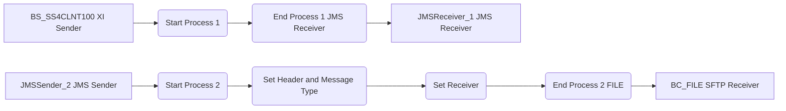

**iFlowId**: ABAP_Proxy_de_XI_migrado - **iFlowVersion**: 1.0.0

**Mermaid Diagram**
- **Visual representation of the flow**

**Functional Summary**
- **Brief description of the iFlow**
This iFlow integrates with an ABAP proxy using the XI protocol, receives a message via HTTP, enriches it with SAP sender and message type information, then enriches it with a receiver, and sends the message to a file system using the SFTP protocol. A JMS Queue is also used as an inbound endpoint.

- **Involved systems with Adapters Type and Endpoint Type**
    - BS_SS4CLNT100 (EndpointSender): XI, HTTP
    - JMSSender_2 (EndpointSender): JMS, Not Applicable
    - JMSReceiver_1 (EndpointRecevier): JMS, Not Applicable
    - BC_FILE (EndpointRecevier): SFTP, File

- **Key steps**
    1.  Receive a message via HTTP XI from BS_SS4CLNT100.
    2.  Receive a message via JMS from JMSReceiver_1.
    3.  Set SAP Sender and Message Type headers (BS_SS4CLNT100).
    4.  Set the SAP Receiver header (BC_FILE).
    5.  Send the message to file system via SFTP.

- **Message transformation**
    - Enricher: Sets `SAP_Sender` header with value `BS_SS4CLNT100`.
    - Enricher: Sets `SAP_MessageType` header with an empty string.
    - Enricher: Sets `SAP_Receiver` header with value `BC_FILE`.

- **Externalized parameters list and their descriptions**
    - `MessageFlow_1001_UseMessageCompression`: Use Message Compression for JMS Receiver.
    - `MessageFlow_1001_QueueName_outbound`: Queue Name for JMS Receiver.
    - `MessageFlow_1001_EncryptMessage`: Encrypt Message for JMS Receiver.
    - `MessageFlow_1001_RetentionThresholdAlerting`: Retention Threshold Alerting for JMS Receiver.
    - `MessageFlow_1001_ExpirationPeriod`: Expiration Period for JMS Receiver.
    - `MessageFlow_1001_TransferExchangeProperties`: Transfer Exchange Properties for JMS Receiver.
    - `MessageFlow_1003_NumberConcurrentProcesses`: Number of concurrent processes for JMS Sender.
    - `MessageFlow_1003_MaxRetryInterval`: Max retry interval for JMS Sender.
    - `MessageFlow_1003_useDeadLetterQueue`: Use Dead Letter Queue for JMS Sender.
    - `MessageFlow_1003_ExponentialBackoff`: Exponential Backoff for JMS Sender.
    - `MessageFlow_1003_QueueName_inbound`: Queue Name for JMS Sender.
    - `MessageFlow_1003_RetryInterval`: Retry Interval for JMS Sender.
    - `MessageFlow_1_RetryInterval_inbound`: Retry interval for inbound XI.
    - `MessageFlow_1_CommunicationPartyReceiver`: Communication party receiver for inbound XI.
    - `MessageFlow_1_TempStorage_inbound`: Temporary storage for inbound XI.
    - `MessageFlow_1_ExponentialBackoff_inbound`: Exponential backoff for inbound XI.
    - `MessageFlow_1_ExpirationPeriod_inbound`: Expiration period for inbound XI.
    - `MessageFlow_1_EncryptRMPersistence_inbound`: Encrypt RM persistence for inbound XI.
    - `MessageFlow_1_maximumAttachmentSize`: Maximum attachment size for inbound XI.
    - `MessageFlow_1_LockTimeout_inbound`: Lock timeout for inbound XI.
    - `MessageFlow_1_PollDelay_inbound`: Poll delay for inbound XI.
    - `MessageFlow_1_CommunicationComponentReceiver`: Communication component receiver for inbound XI.
    - `MessageFlow_1_clientCertificate.subjectDN`: Client certificate subject DN for inbound XI.
    - `MessageFlow_1_clientCertificate.issuerDN`: Client certificate issuer DN for inbound XI.
    - `MessageFlow_1_maximumBodySize`: Maximum body size for inbound XI.
    - `MessageFlow_1_Address_inbound`: Address for inbound XI.
    - `MessageFlow_1_NumberConcurrentProcesses_inbound`: Number of concurrent processes for inbound XI.
    - `MessageFlow_1_UseMessageCompression_inbound`: Use message compression for inbound XI.
    - `MessageFlow_1_MaxRetryInterval_inbound`: Maximum retry interval for inbound XI.
    - `MessageFlow_1_QualityOfService_inbound`: Quality of Service for inbound XI.
    - `MessageFlow_1_userRole`: User Role for inbound XI.
    - `MessageFlow_1_senderAuthType`: Sender Authentication Type for inbound XI.
    - `MessageFlow_1_useDeadLetterQueue_inbound`: Use Dead Letter Queue for inbound XI.
    - `MessageFlow_3_disconnect`: Disconnect for File.
    - `MessageFlow_3_fileName`: File name for File.
    - `MessageFlow_3_maximumReconnectAttempts`: Maximum Reconnect Attempts for File.
    - `MessageFlow_3_stepwise`: Stepwise for File.
    - `MessageFlow_3_fileExist`: File Exist for File.
    - `MessageFlow_3_autoCreate`: Auto Create for File.
    - `MessageFlow_3_privateKeyAlias`: Private Key Alias for File.
    - `MessageFlow_3_location_id`: Location ID for File.
    - `MessageFlow_3_flatten`: Flatten for File.
    - `MessageFlow_3_sftpSecEnabled`: SFTP Sec Enabled for File.
    - `MessageFlow_3_useTempFile`: Use Temp File for File.
    - `MessageFlow_3_path`: Path for File.
    - `MessageFlow_3_proxyPort`: Proxy Port for File.
    - `MessageFlow_3_host`: Host for File.
    - `MessageFlow_3_connectTimeout`: Connect Timeout for File.
    - `MessageFlow_3_fastExistsCheck`: Fast Exists Check for File.
    - `MessageFlow_3_authentication`: Authentication for File.
    - `MessageFlow_3_fileAppendTimeStamp`: File Append Time Stamp for File.
    - `MessageFlow_3_credential_name`: Credential Name for File.
    - `MessageFlow_3_proxyProtocol`: Proxy Protocol for File.
    - `MessageFlow_3_proxyType`: Proxy Type for File.
    - `MessageFlow_3_proxyAlias`: Proxy Alias for File.
    - `MessageFlow_3_reconnectDelay`: Reconnect Delay for File.
    - `MessageFlow_3_proxyHost`: Proxy Host for File.
    - `MessageFlow_3_tempFileName`: Temp File Name for File.
    - `MessageFlow_3_allowDeprecatedAlgorithms`: Allow Deprecated Algorithms for File.
    - `MessageFlow_3_username`: Username for File.

- **DataStore / JMS Dependency**
Yes

- **Cloud Connector Dependency**
Not Found

- **Common Scripts Dependency**
Not Found

- **ProcessDirect ComponentType Dependency**
Not Found