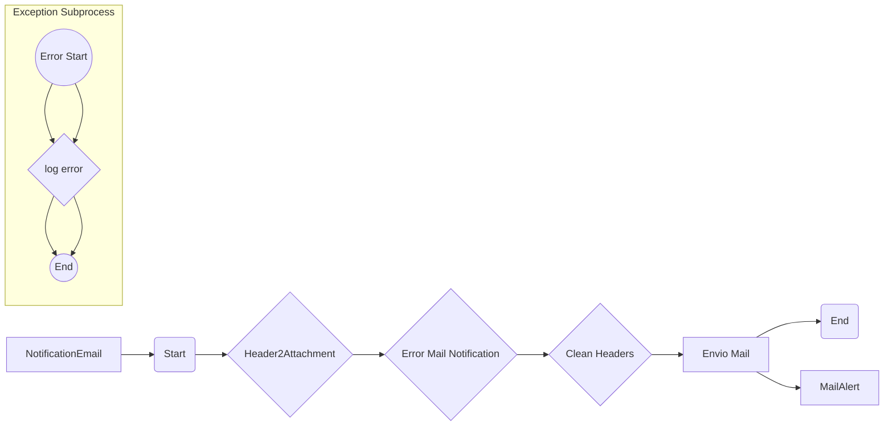

**iFlowId**: Common_-_Error_Notification_Email - **iFlowVersion**: 1.1.5

**Mermaid Diagram**

**Functional Summary**
**Brief description of the iFlow**
This iFlow is designed to send email notifications when an error occurs in other integration flows. It receives error information via ProcessDirect, formats it, and sends an email to specified recipients.

**Involved systems with Adapters Type and Endpoint Type**
- NotificationEmail: Adapter Type: ProcessDirect, Endpoint Type: EndpointSender
- MailAlert: Adapter Type: Mail, Endpoint Type: EndpointRecevier

**Key steps**
1. Receive error information via ProcessDirect.
2. Convert header 'Attachment' to an actual attachment using a Groovy script.
3. Format the error information into a user-friendly email body using another Groovy script.
4. Clean the message headers, specifically removing the `Attachment` header.
5. Send the email via SMTP.

**Message transformation**
- HeaderToAttachment.groovy: Converts the content of header 'Attachment' into message attachment.
- Error_Email_Notification.groovy: Formats the message body for the email notification.
- Clean Headers: Removes the `Attachment` header

**Externalized parameters list and their descriptions**
- EMAIL_SERVER: The SMTP server address for sending emails.
- AUTH_TYPE: The authentication type for the SMTP server.
- PROTECTION_TYPE: The SSL/TLS protection type for the SMTP connection.
- LOCATION_ID: The location ID for the mail server.
- EMAIL_ALERT_SENDER: The email address used as the sender for the email notification.
- PROXY_TYPE: The type of proxy used to connect to the mail server, if any.
- AUTH_BASIC: User/Password for basic Authentication

**DataStore / JMS Dependency**
Not Found

**Cloud Connector Dependency**
Not Found

**Common Scripts Dependency**
- Common_-_Groovy_Logging_Scripts: Log_Exception.groovy
- Common_-_Groovy_Util_Scripts: HeaderToAttachment.groovy
- Common_-_Groovy_Email_Notification_Scripts: Error_Email_Notification.groovy

**ProcessDirect ComponentType Dependency**
- /common/errorNotification