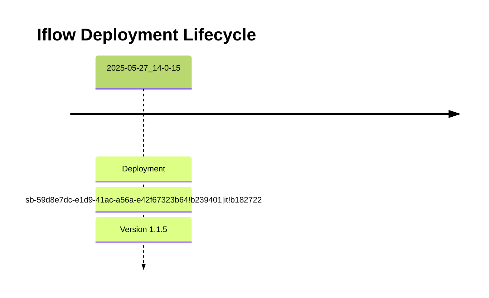

# Integration Flow: Common_-_Error_Notification_Email

This document provides an overview, deployment history, and links to specific versions for the integration flow `Common_-_Error_Notification_Email`.

## Deployment History
<!-- DEPLOYMENT_TIMELINE_START -->

<!-- DEPLOYMENT_TIMELINE_END -->

## Available Versions
<!-- VERSION_LINKS_START -->
- [Version 1.1.5 (Deployed: 2025-05-27 14:00:15 CEST CEST)](./1.1.5/readme.md)
<!-- VERSION_LINKS_END -->