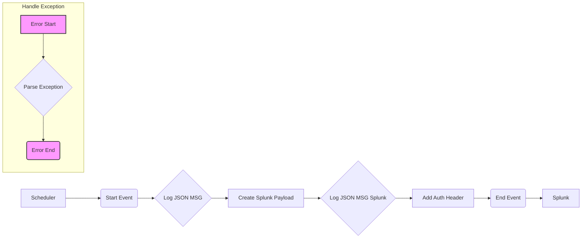

**iFlowId:** Avvale_-_SAP_Integration_Suite_-_CPI_Monitor_-_SPLUNK - **iFlowVersion:** 1.0.0

**Mermaid Diagram**

**Functional Summary**
- **Brief description of the iFlow**
This iFlow collects monitoring data from SAP Integration Suite and sends it to Splunk. It's triggered by a scheduler, transforms the data into a Splunk-compatible format, and sends it via HTTP.  An error sub-process is included to handle exceptions during the flow.

- **Involved systems with Adapters Type and Endpoint Type**
    - Scheduler: MonitoringAdapter (Sender)
    - Splunk: HTTP (Receiver)

- **Key steps**
    1. Start the flow via Scheduler with the MonitoringAdapter.
    2. Log the initial JSON message using a Groovy script.
    3. Create a Splunk payload using a Groovy script.
    4. Log the Splunk JSON message using a Groovy script.
    5. Add Authorization and Content-Type headers to the message.
    6. Send the message to Splunk via HTTP adapter.
    7. Handle exceptions using an error sub-process involving a Groovy script.

- **Message transformation**
    - The iFlow uses a Groovy script (`bplus_SPLUNK_CPI_cSaltos.groovy`) to transform the incoming message into a format suitable for Splunk.
    - Groovy scripts `LogJson.groovy` are used to log the JSON messages at different stages of the flow.
    - A Groovy script (`ParseException.groovy`) is used to parse exception details in case of errors.

- **Externalized parameters list and their descriptions**
    - `ISUTE_HOST`: Integration Suite host.
    - `ISUITE_SYSTEM_ID`: Integration Suite system ID.
    - `INITIAL_DELAY`: Initial delay for the scheduler.
    - `ISUITE_CLIENT`: Integration Suite client.
    - `TIME_SHIFT`: Time difference for monitoring.
    - `LICENSE_KEY`: License key for the monitoring adapter.
    - `ISUITE_CLIENT_SHORT`: Short Integration Suite client identifier.
    - `ISUITE_CREDENTIALS_ENTRY`: Credentials entry for Integration Suite authentication.
    - `ISUITE_PORT`: Integration Suite port.
    - `DELAY`: Delay for the scheduler.
    - `ISUITE_MONITORING_TIME`: Time interval for monitoring.
    - `ISUITE_DESCRIPTION`: Description of the Integration Suite instance.
    - `PROXY_TYPE`: Type of proxy server to use, if any.
    - `LOCATION_ID`: Location ID for Splunk.
    - `SPLUNK_HOST`: Splunk host address.
    - `SPLUNK_PORT`: Splunk port number.
    - `SPLUNK_TOKEN`: Splunk authorization token.

- **DataStore / JMS Dependency**
Not Found

- **Cloud Connector Dependency**
Not Found

- **Common Scripts Dependency**
- LogJson.groovy
- bplus_SPLUNK_CPI_cSaltos.groovy
- ParseException.groovy

- **ProcessDirect ComponentType Dependency**
Not Found