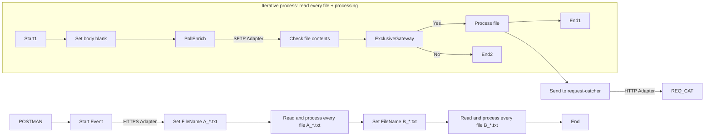

**iFlowId**: Test_-_Poll_SFTP_using_HTTPS_call_as_trigger - **iFlowVersion**: 1.0.4

**Mermaid Diagram**

**BPMN Diagram**

**Functional Summary**
- **Brief description of the iFlow**
This iFlow is triggered by an HTTPS call. It then polls an SFTP server for files, processes each file, and sends data to a request catcher service (REQ_CAT) via HTTP.

- **Involved systems with Adapters Type and Endpoint Type**
    - POSTMAN - HTTPS - EndpointSender
    - SFTP - PollingSFTP - EndpointSender
    - REQ_CAT - HTTP - EndpointRecevier

- **Key steps**
 1. Receives HTTPS request.
 2. Sets the filename property (A_*.txt).
 3. Polls SFTP server to reads files matching the filename property (A_*.txt).
 4. Sets the filename property (B_*.txt).
 5. Polls SFTP server to reads files matching the filename property (B_*.txt).
 6. For each file found in SFTP server runs:
     - Sets body blank using groovy script.
     - Reads a file content from SFTP server.
     - Checks file content using groovy script.
     - If file content validation is true, send file to Process file
     - Process the file and sends to request-catcher service (REQ_CAT).

- **Message transformation**
    - Set filename property A_*.txt using content modifier.
    - Set filename property B_*.txt using content modifier.
    - Sets body blank using groovy script.
    - Checks file content using groovy script.

- **Externalized parameters list, configured values and their descriptions**
Not Found

- **DataStore / JMS Dependency**
Not Found

- **Cloud Connector Dependency**
Not Found

- **Common Scripts Dependency**
Not Found

- **ProcessDirect ComponentType Dependency**
Not Found