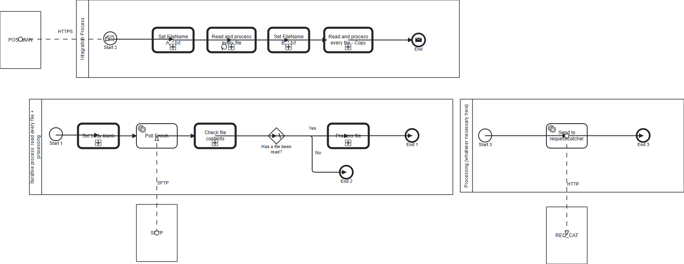

**iFlowId**: Test_-_Poll_SFTP_using_HTTPS_call_as_trigger - **iFlowVersion**: 1.0.4

**Mermaid Diagram**
```mermaid
graph LR
    A[POSTMAN] -->|HTTPS Adapter| B(Start Event)
    B --> C{Set FileName A_*.txt}
    C --> D{Read and process every file}
    D --> E{Set FileName B_*.txt}
    E --> F{Read and process every file - Copy}
    F --> G(End Event)
    
    subgraph IterativeProcess1 [Iterative process: read every file + processing]
        H(Start 1) --> I{Set body blank}
        I --> J[Poll Enrich]
        J --> K{Check file contents}
        K -- Yes --> L[Process file]
        K -- No --> M(End 2)
        L --> N(End 1)
        J -->|SFTP Adapter| O[SFTP]
        L --> P[Processing SubProcess]
    end
    
    subgraph ProcessingSubProcess [Processing (whatever necessary here)]
     Q(Start 3) --> R[Send to request-catcher]
     R -->|HTTP Adapter| S[REQ_CAT]
     R --> T(End 3)
    end

    D --> IterativeProcess1
    F --> IterativeProcess1
```
**BPMN Diagram**



**Functional Summary**
- **Brief description of the iFlow**
The iFlow is triggered by an HTTPS call. It polls an SFTP server for files, processes each file in a loop, and then sends data to a request catcher via HTTP.

- **Involved systems with Adapters Type and Endpoint Type**
    - POSTMAN - HTTPS - EndpointSender
    - SFTP - PollingSFTP - EndpointSender
    - REQ_CAT - HTTP - EndpointRecevier

- **Key steps**
 1. Receive HTTPS request from POSTMAN.
 2. Set the filename (A_*.txt).
 3. Poll the SFTP server for files matching the filename (A_*.txt).
 4. Set the filename (B_*.txt).
 5. Poll the SFTP server for files matching the filename (B_*.txt).
 6. For each polled file, check file contents using a Groovy script (ContinueReading.groovy).
 7. If a file has been read, call a sub-process to process file contents.
 8. The subprocess sends the file contents to Request Catcher using HTTP adapter.
 9. If no file has been read, end the process.
 10. End the main process.

- **Message transformation**
   - Sets the FileName property to "A_*.txt" or "B_*.txt" using a Content Modifier.
   - Sets the body to blank using a Groovy Script (SetBodyBlank.groovy).

- **Externalized parameters list, configured values and their descriptions**
Not Found

- **DataStore / JMS Dependency**
Not Found

- **Cloud Connector Dependency**
Not Found

- **Common Scripts Dependency**
Not Found

- **ProcessDirect ComponentType Dependency**
Not Found