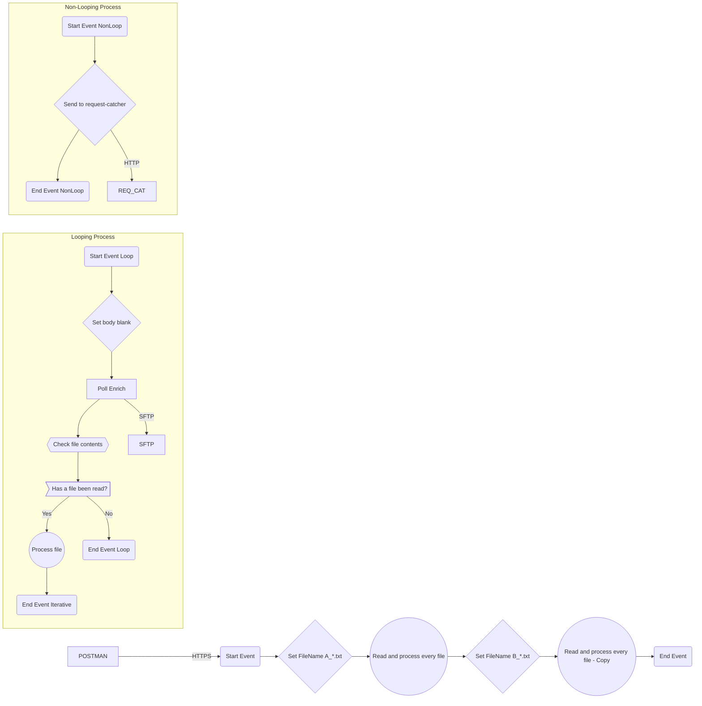

**iFlowId**: Test_-_Poll_SFTP_using_HTTPS_call_as_trigger - **iFlowVersion**: 1.0.4

**Mermaid Diagram**

**BPMN Diagram**

**Functional Summary**
- **Brief description of the iFlow**
The iFlow is triggered by an HTTPS call. It polls an SFTP server for files, processes each file, and sends the processed data to a request catcher endpoint via HTTP.

- **Involved systems with Adapters Type and Endpoint Type**
  - POSTMAN - HTTPS - EndpointSender
  - SFTP - PollingSFTP - EndpointSender
  - REQ_CAT - HTTP - EndpointRecevier

- **Key steps**
 1. Receive HTTPS request.
 2. Set the filename property to "A_*.txt".
 3. Iteratively poll the SFTP server for files matching the filename property.
 4. For each file found:
    - Set the body to blank.
    - Poll the SFTP server for the file.
    - Check file contents using a groovy script.
    - If a file has been read, process the file by calling a local integration process "Processing (whatever necessary here)". This process sends the file content to a request-catcher endpoint using the HTTP adapter.
    - If no file has been read the iterative process stops.
 5. Set the filename property to "B_*.txt".
 6. Iteratively poll the SFTP server for files matching the filename property (same as step 3 and 4).

- **Message transformation**
  - The content of each SFTP file is processed by a "Process file" call activity that contains a "Send to request-catcher" service task.

- **Externalized parameters list, configured values and their descriptions**
  - Not Found

- **DataStore / JMS Dependency**
  - Not Found

- **Cloud Connector Dependency**
  - Not Found

- **Common Scripts Dependency**
  - Not Found

- **ProcessDirect ComponentType Dependency**
  - Not Found