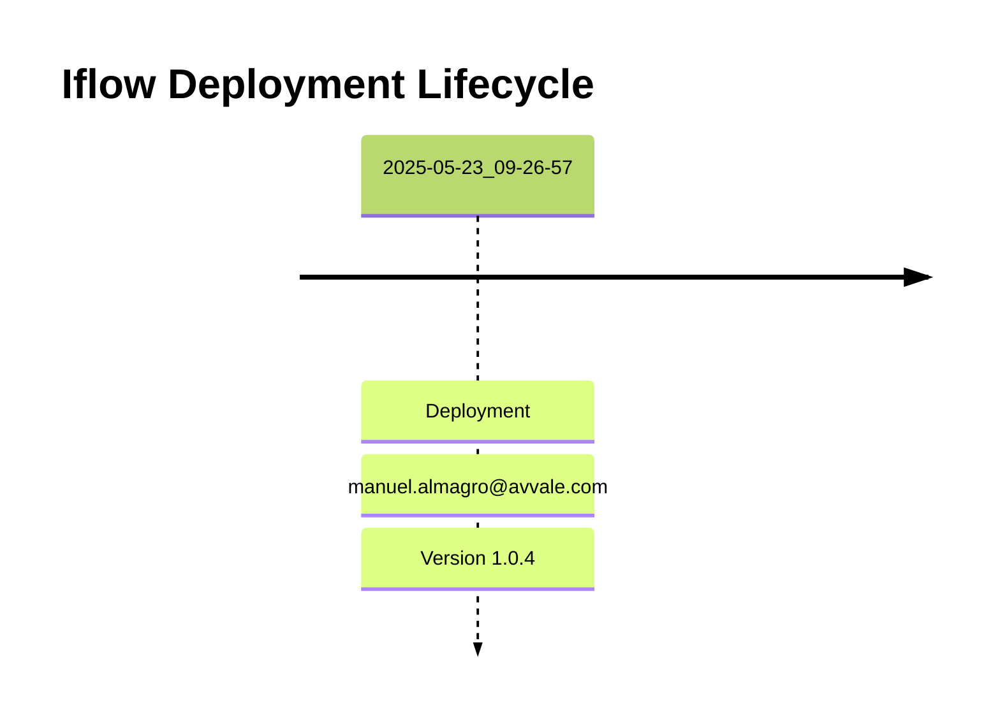

# Integration Flow: Test_-_Poll_SFTP_using_HTTPS_call_as_trigger

This document provides an overview, deployment history, and links to specific versions for the integration flow `Test_-_Poll_SFTP_using_HTTPS_call_as_trigger`.

## Deployment History
<!-- DEPLOYMENT_TIMELINE_START -->

<!-- DEPLOYMENT_TIMELINE_END -->

## Available Versions
<!-- VERSION_LINKS_START -->
- [Version 1.0.4 (Deployed: 2025-05-23 09:26:57 CEST CEST)](./1.0.4/readme.md)
<!-- VERSION_LINKS_END -->