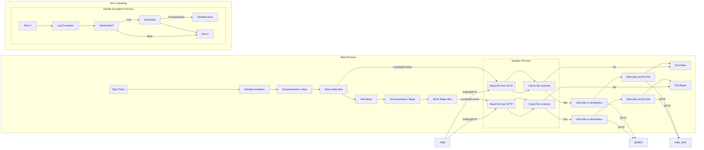

**iFlowId**: com.es.A3Media.s4hana2sii.filesIntegration.globalprocess - **iFlowVersion**: 1.0.14

**Mermaid Diagram**

**BPMN Diagram**

**Functional Summary**
- **Brief description of the iFlow**
This iFlow integrates SAP S/4HANA with SII (Suministro Inmediato de Información) by processing files (Altas, Bajas, Modificaciones) sequentially from an SFTP server, transforming and sending them to SERES, and archiving the files.  It includes error handling and logging.

- **Involved systems with Adapters Type and Endpoint Type**
    - A3M (Sender): PollingSFTP Adapter, EndpointSender
    - SERES (Receiver): SFTP Adapter, EndpointRecevier
    - A3M_ARC (Receiver): SFTP Adapter, EndpointRecevier
    - AlertReceiver (Receiver): ProcessDirect Adapter, EndpointRecevier

- **Key steps**
    1.  Start Timer to trigger the process.
    2.  Set headers and properties for processing.
    3.  Set parameters for Altas files (Source, Destination, ArchiveDir, FilenamePattern).
    4.  Read Altas files from SFTP.
    5.  Check file contents to determine if a file was read.
    6.  If a file was read, send it to the destination.
    7.  Archive the processed file.
    8. Add Delay between Altas and Bajas processing.
    9. Set parameters for Bajas files (FilenamePattern).
    10. Read Bajas files from SFTP.
    11. Check file contents to determine if a file was read.
    12. If a file was read, send it to the destination.
    13. Archive the processed file.
    14. Handle any exceptions that occur during the process.

- **Message transformation**
    - The iFlow uses groovy scripts (SetBodyBlank.groovy, ContinueReading.groovy, Log_Discarded_Message.groovy, Log_Exception.groovy, AddDelay.groovy) for message transformation.
    -  The "Maintain headers" call activity also modifies headers and properties.

- **Externalized parameters list, configured values and their descriptions**
    - SERES_DIR: /in (SERES Input Directory)
    - ArchiveErrorsDir:  (Archive Directory for Errors)
    - SFTP_SERES_SECUREPARAMETER: SFTP_SII_USER (Secure Parameter for SERES SFTP)
    - BajasDelayAfterAltas: 30 (Delay in seconds after Altas processing before starting Bajas processing)
    - SENDER_BC: A3MEDIA_SFTP (Sender Business Component)
    - SFTP_RISE_CREDENTIALS: SFTP_DEVTEST_DELETE (Credentials for RISE SFTP)
    - SFTP_SERES_CREDENTIALS:  (Credentials for SERES SFTP)
    - SAP_MessageType_Mod: FicheroModificaciones (SAP Message Type for Modificaciones files)
    - DelayBetweenBatches: 10 (Delay in seconds between processing batches)
    - SFTP_RISE_SERVER: eu-central-1.sftpcloud.io (RISE SFTP Server Address)
    - RECEIVER_BC: SERES_SFTP (Receiver Business Component)
    - ModDelayAfterAltas: 60 (Delay in seconds after Altas processing before starting Modificaciones processing)
    - SFTP_MOD_FILENAME: *\#*\#*\#M.* (Filename pattern for Modificaciones files)
    - SFTP_BAJAS_FILENAME: B_*.txt (Filename pattern for Bajas files)
    - SAP_MessageType_Bajas: FicheroBajas (SAP Message Type for Bajas files)
    - SFTP_RISE_LOCATION:  (RISE SFTP Location ID)
    - SFTP_SERES_TIMEOUT: 15000 (Timeout in milliseconds for SERES SFTP connection)
    - Logging: true (Enable/Disable Logging)
    - SFTP_SERES_PRIVATEKEY:  (Private key alias for SERES SFTP)
    - SAP_MessageType_Altas: FicheroAltas (SAP Message Type for Altas files)
    - Email_Notification: true (Enable/Disable Email Notification)
    - ArchiveSuccessfulDir: /archive (Archive Directory for Successful files)
    - SFTP_RISE_DIR: /in (RISE SFTP Input Directory)
    - Timer:  (Timer configuration for iFlow execution)
    - SFTP_SERES_SERVER: eu-central-1.sftpcloud.io:22 (SERES SFTP Server Address and Port)
    - SFTP_ALTAS_FILENAME: A_*.txt (Filename pattern for Altas files)

- **DataStore / JMS Dependency**
    Not Found

- **Cloud Connector Dependency**
    Not Found

- **Common Scripts Dependency**
    - Common_-_Groovy_Logging_Scripts

- **ProcessDirect ComponentType Dependency**
    - /common/errorNotification