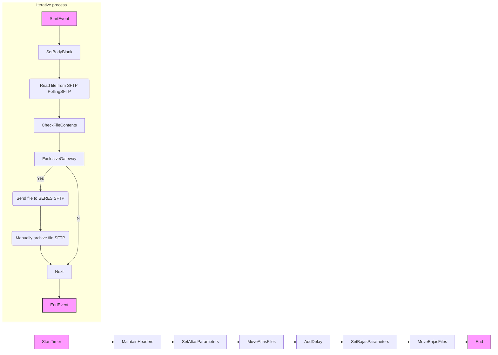
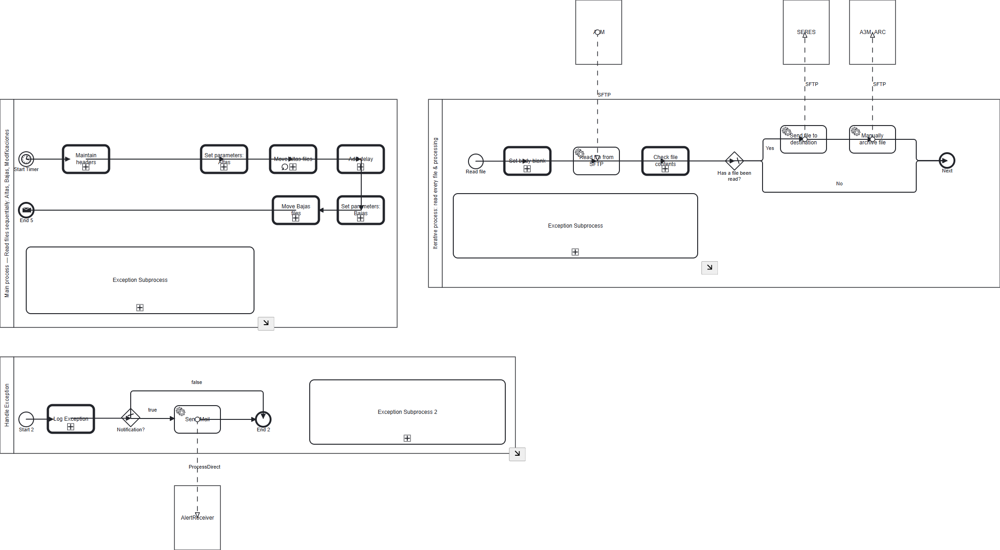

**iFlowId**: com.es.A3Media.s4hana2sii.filesIntegration.globalprocess - **iFlowVersion**: 1.0.14

**Mermaid Diagram**

**BPMN Diagram**

**Functional Summary**
- **Brief description of the iFlow**
The iFlow integrates files from A3M's SFTP server, processes them, and sends them to SERES's SFTP server. It handles Altas, Bajas, and Modificaciones files sequentially, archiving them after processing. The iFlow includes exception handling and notification mechanisms.

- **Involved systems with Adapters Type and Endpoint Type**
    - A3M (PollingSFTP, EndpointSender)
    - SERES (SFTP, EndpointRecevier)
    - A3M_ARC (SFTP, EndpointRecevier)
    - AlertReceiver (ProcessDirect, EndpointRecevier)

- **Key steps**
    1. Start Timer to initiate the file processing.
    2. Set headers and properties for the integration flow.
    3. Set parameters specific to Altas files (source, destination, filename pattern).
    4. Move Altas files from the source SFTP to SERES using an iterative process.
    5. Add a delay between processing batches of files.
    6. Set parameters specific to Bajas files (filename pattern).
    7. Move Bajas files from the source SFTP to SERES using an iterative process.
    8. End the process.
    9. Iterate files from SFTP A3M, Check the file content and send to destination
    10. Archive file in A3M_ARC.

- **Message transformation**
    - The iFlow uses a Content Modifier to set headers (SAP_Sender, SAP_Receiver, SAP_MessageType) and properties (ArchiveDir, InboundRequest, Logging, DelayBetweenBatches, SFTP_SERES_SECUREPARAMETER, ArchiveErrorsDir, ArchiveSuccessfulDir).
    - Groovy scripts are used to set the body blank and check file contents.

- **Externalized parameters list, configured values and their descriptions**
    - `SERES_DIR`: `/in` (SERES Directory)
    - `ArchiveErrorsDir`: `` (Archive Errors Directory)
    - `SFTP_SERES_SECUREPARAMETER`: `SFTP_SII_USER` (SFTP SERES Secure Parameter)
    - `BajasDelayAfterAltas`: `30` (Delay in seconds after processing Altas files before processing Bajas files)
    - `SENDER_BC`: `A3MEDIA_SFTP` (Sender Business Component)
    - `SFTP_RISE_CREDENTIALS`: `SFTP_DEVTEST_DELETE` (SFTP RISE Credentials)
    - `SFTP_SERES_CREDENTIALS`: `` (SFTP SERES Credentials)
    - `SAP_MessageType_Mod`: `FicheroModificaciones` (SAP Message Type for Modificaciones)
    - `DelayBetweenBatches`: `10` (Delay in seconds between processing batches)
    - `SFTP_RISE_SERVER`: `eu-central-1.sftpcloud.io` (SFTP RISE Server)
    - `RECEIVER_BC`: `SERES_SFTP` (Receiver Business Component)
    - `ModDelayAfterAltas`: `60` (Delay in seconds after processing Altas files before processing Modificaciones files)
    - `SFTP_MOD_FILENAME`: `*\#*\#*\#M.*` (SFTP Modificaciones Filename Pattern)
    - `SFTP_BAJAS_FILENAME`: `B_*.txt` (SFTP Bajas Filename Pattern)
    - `SAP_MessageType_Bajas`: `FicheroBajas` (SAP Message Type for Bajas)
    - `SFTP_RISE_LOCATION`: `` (SFTP RISE Location)
    - `SFTP_SERES_TIMEOUT`: `15000` (SFTP SERES Timeout in milliseconds)
    - `Logging`: `true` (Enable/Disable logging)
    - `SFTP_SERES_PRIVATEKEY`: `` (SFTP SERES Private Key Alias)
    - `SAP_MessageType_Altas`: `FicheroAltas` (SAP Message Type for Altas)
    - `Email_Notification`: `true` (Enable/Disable Email Notification)
    - `ArchiveSuccessfulDir`: `/archive` (Archive Successful Directory)
    - `SFTP_RISE_DIR`: `/in` (SFTP RISE Directory)
    - `Timer`: `<row><cell>dateType</cell><cell>SIMPLE</cell></row><row><cell>hourValue</cell><cell>10</cell></row><row><cell>minutesValue</cell><cell>48</cell></row><row><cell>timeType</cell><cell>ON_TIME</cell></row><row><cell>timeZone</cell><cell>( UTC 0\:00 ) Greenwich Mean Time(Etc/GMT)</cell></row><row><cell>throwExceptionOnExpiry</cell><cell>true</cell></row><row><cell>second</cell><cell>0</cell></row><row><cell>minute</cell><cell>0/5</cell></row><row><cell>hour</cell><cell>*</cell></row><row><cell>day_of_month</cell><cell>?</cell></row><row><cell>month</cell><cell>*</cell></row><row><cell>dayOfWeek</cell><cell>*</cell></row><row><cell>year</cell><cell>*</cell></row><row><cell>startAt</cell><cell>2025-05-23T00\:00\:00</cell></row><row><cell>endAt</cell><cell>2050-01-01T00\:00\:00</cell></row><row><cell>attributeBehaviour</cell><cell>isThrowExceptionOnExpiryVisible,isScheduleAdvancedVisible,isScheduleAdvancedStartEndVisible,isScheduleSimpleVisible</cell></row><row><cell>triggerType</cell><cell>cron</cell></row><row><cell>noOfSchedules</cell><cell>1</cell></row><row><cell>schedule1</cell><cell>simple.repeat\=NONE&amp;trigger.timeZone\=Etc/GMT</cell></row>` (Timer Configuration)
    - `SFTP_SERES_SERVER`: `eu-central-1.sftpcloud.io:22` (SFTP SERES Server Address)
    - `SFTP_ALTAS_FILENAME`: `A_*.txt` (SFTP Altas Filename Pattern)

- **DataStore / JMS Dependency**
Not Found

- **Cloud Connector Dependency**
Not Found

- **Common Scripts Dependency**
    - Common_-_Groovy_Logging_Scripts:
        - Log_Discarded_Message.groovy
        - Log_Exception.groovy

- **ProcessDirect ComponentType Dependency**
    - /common/errorNotification