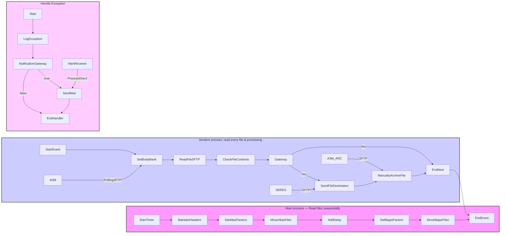

**iFlowId:** com.es.A3Media.s4hana2sii.filesIntegration.globalprocess - **iFlowVersion:** 1.0.15

**Mermaid Diagram**

**BPMN Diagram**

**Functional Summary**
- **Brief description of the iFlow**
This iFlow reads files sequentially (Altas, Bajas, Modificaciones) from an SFTP server, processes them iteratively, sends the processed files to a destination SFTP server, and archives the files. It also handles exceptions and sends email notifications.

- **Involved systems with Adapters Type and Endpoint Type**
    - A3M: PollingSFTP (Sender), EndpointSender
    - SERES: SFTP (Receiver), EndpointRecevier
    - A3M_ARC: SFTP (Receiver), EndpointRecevier
    - AlertReceiver: ProcessDirect (Receiver), EndpointRecevier

- **Key steps**
    1.  Start Timer
    2.  Maintain headers
    3.  Set parameters for Altas
    4.  Move Altas files (iterative process)
    5.  Add delay
    6.  Set parameters for Bajas
    7.  Move Bajas files (iterative process)
    8. Handle Exceptions

- **Message transformation**
    - Set body blank (SetBodyBlank.groovy)
    - Check file contents (ContinueReading.groovy)

- **Externalized parameters list, configured values and their descriptions**
    - SERES_DIR: /in
    - ArchiveErrorsDir: (empty)
    - SFTP_SERES_SECUREPARAMETER: SFTP_SII_USER
    - BajasDelayAfterAltas: 30
    - SENDER_BC: A3MEDIA_SFTP
    - SFTP_RISE_CREDENTIALS: SFTP_DEVTEST_DELETE
    - SFTP_SERES_CREDENTIALS: (empty)
    - SAP_MessageType_Mod: FicheroModificaciones
    - DelayBetweenBatches: 30
    - SFTP_RISE_SERVER: eu-central-1.sftpcloud.io
    - RECEIVER_BC: SERES_SFTP
    - ModDelayAfterAltas: 60
    - SFTP_MOD_FILENAME: *\#*\#*\#M.*
    - SFTP_BAJAS_FILENAME: B_*.txt
    - SAP_MessageType_Bajas: FicheroBajas
    - SFTP_RISE_LOCATION: (empty)
    - SFTP_SERES_TIMEOUT: 15000
    - Logging: true
    - SFTP_SERES_PRIVATEKEY: (empty)
    - SAP_MessageType_Altas: FicheroAltas
    - Email_Notification: true
    - ArchiveSuccessfulDir: /archive
    - SFTP_RISE_DIR: /in
    - Timer: Cron expression to trigger the iFlow periodically. Configured to run every 5 minutes.
    - SFTP_SERES_SERVER: eu-central-1.sftpcloud.io:22
    - SFTP_ALTAS_FILENAME: A_*.txt

- **DataStore / JMS Dependency**
Not Found

- **Cloud Connector Dependency**
Not Found

- **Common Scripts Dependency**
    - Log_Discarded_Message.groovy, scriptBundleId: Common_-_Groovy_Logging_Scripts
    - Log_Exception.groovy, scriptBundleId: Common_-_Groovy_Logging_Scripts

- **ProcessDirect ComponentType Dependency**
    - /common/errorNotification