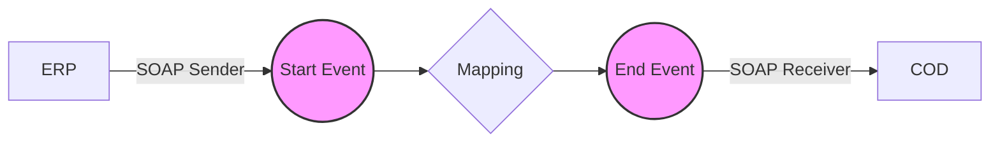

**iFlowId**: Check_Connectivity_from_SAP_Business_Suite_MMZ - **iFlowVersion**: 1.0.3

**Mermaid Diagram**

**Functional Summary**
- **Brief description of the iFlow**
The iFlow performs an end-to-end connectivity check from SAP ERP to SAP Cloud for Customer (COD) via SAP Integration Suite.

- **Involved systems with Adapters Type and Endpoint Type**
    - ERP (SOAP Sender, EndpointSender)
    - COD (SOAP Receiver, EndpointRecevier)

- **Key steps**
    1.  Receive SOAP message from ERP.
    2.  Execute Operation Mapping to transform the message.
    3.  Send SOAP message to COD.

- **Message transformation**
    - ERP_COD_ConnectivityCheck.opmap is used for mapping between ERP and COD.

- **Externalized parameters list and their descriptions**
    - ERP_enableBasicAuthentication_8: Enables basic authentication for ERP connection.
    - subject: Subject for ERP connection.
    - issuer: Issuer for ERP connection.
    - ERP_address_1: Address for the ERP SOAP endpoint.
    - ERP_wsdlURL_0: WSDL URL for the ERP SOAP endpoint.
    - Host: Host for COD SOAP endpoint.
    - Port: Port for COD SOAP endpoint.
    - COD_enableBasicAuthentication_6: Enables basic authentication for COD connection.
    - artifactname: Credential name for COD connection.
    - pr-key-alias: Private key alias for COD connection.

- **DataStore / JMS Dependency**
Not Found

- **Cloud Connector Dependency**
Not Found

- **Common Scripts Dependency**
Not Found

- **ProcessDirect ComponentType Dependency**
Not Found