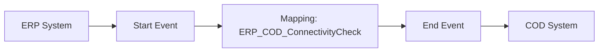

**iFlowId**: Check_Connectivity_from_SAP_Business_Suite_MMZ - **iFlowVersion**: 1.0

**Mermaid Diagram**
- **Visual representation of the flow**

**Functional Summary**
- **Brief description of the iFlow**
  This iFlow performs an end-to-end connectivity check from SAP ERP to SAP Cloud for Customer (C4C) via SAP Integration Suite.

- **Involved systems with Adapters Type and Endpoint Type**
  - ERP: SOAP Adapter, HTTP Endpoint
  - COD (C4C): SOAP Adapter, HTTP Endpoint

- **Key steps**
  1. The iFlow starts with a message from the ERP system.
  2. An Operation Mapping step transforms the message.
  3. The iFlow ends by sending a message to the COD system.

- **Message transformation**
  - `ERP_COD_ConnectivityCheck` operation mapping is used.

- **Externalized parameters list and their descriptions**
  - `ERP_enableBasicAuthentication_8`: Enables basic authentication for the ERP endpoint.
  - `subject`: Subject for ERP endpoint.
  - `issuer`: Issuer for ERP endpoint.
  - `ERP_address_1`: Address of the ERP endpoint.
  - `ERP_wsdlURL_0`: WSDL URL of the ERP endpoint.
  - `Host`: Host for the COD endpoint URL.
  - `Port`: Port for the COD endpoint URL.
  - `COD_enableBasicAuthentication_6`: Enables basic authentication for the COD endpoint.
  - `artifactname`: Credential name for the COD endpoint.
  - `pr-key-alias`: Private Key Alias for the COD endpoint.

- **DataStore / JMS Dependency**
  Not Found

- **Cloud Connector Dependency**
  Not Found

- **Common Scripts Dependency**
  Not Found

- **ProcessDirect ComponentType Dependency**
  Not Found