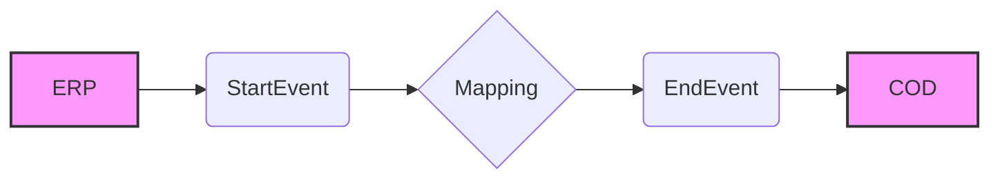

**iFlowId**: Check_Connectivity_from_SAP_Business_Suite_MMZ - **iFlowVersion**: 1.0

**Mermaid Diagram**

**Functional Summary**
- **Brief description of the iFlow**
This iFlow performs an end-to-end connectivity check from SAP ERP to SAP Cloud for Customer (COD) via SAP Integration Suite.

- **Involved systems with Adapters Type and Endpoint Type**
  - ERP (Sender): SOAP Adapter, HTTP Endpoint
  - COD (Receiver): SOAP Adapter, HTTP Endpoint

- **Key steps**
  1. Receive a message from the ERP system via SOAP.
  2. Execute a mapping to transform the message.
  3. Send the transformed message to the COD system via SOAP.

- **Message transformation**
  - Mapping: ERP_COD_ConnectivityCheck.opmap

- **Externalized parameters list and their descriptions**
  - ERP_enableBasicAuthentication_8: Enables/disables basic authentication for ERP.
  - subject: Subject for authentication
  - issuer: Issuer for authentication
  - ERP_address_1: Address of the ERP endpoint.
  - ERP_wsdlURL_0: WSDL URL of the ERP endpoint.
  - Host: Hostname for the COD endpoint.
  - Port: Port for the COD endpoint.
  - COD_enableBasicAuthentication_6: Enables/disables basic authentication for COD.
  - artifactname: Credential name for COD authentication.
  - pr-key-alias: Private key alias for COD authentication.

- **DataStore / JMS Dependency**
Not Found

- **Cloud Connector Dependency**
Not Found

- **Common Scripts Dependency**
Not Found

- **ProcessDirect ComponentType Dependency**
Not Found