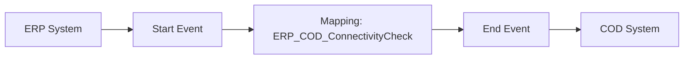

**iFlowId**: Check_Connectivity_from_SAP_Business_Suite_MMZ - **iFlowVersion**: 1.0

**Mermaid Diagram**

**Functional Summary**
- **Brief description of the iFlow**
This iFlow performs an end-to-end connectivity check from SAP ERP to SAP Cloud for Customer via SAP Integration Suite.

- **Involved systems with Adapters Type and Endpoint Type**
    - ERP (EndpointSender, SOAP Adapter)
    - COD (EndpointRecevier, SOAP Adapter)

- **Key steps**
    1. Receive SOAP message from ERP system.
    2. Map the message using the `ERP_COD_ConnectivityCheck` operation mapping.
    3. Send SOAP message to COD system.

- **Message transformation**
    - The iFlow uses the `ERP_COD_ConnectivityCheck.opmap` operation mapping to transform the message between the ERP and COD systems.

- **Externalized parameters list and their descriptions**
    - `ERP_enableBasicAuthentication_8`: Enables basic authentication for the ERP sender adapter.
    - `subject`: Subject for ERP.
    - `issuer`: Issuer for ERP.
    - `ERP_address_1`: Address of the ERP SOAP service.
    - `ERP_wsdlURL_0`: WSDL URL of the ERP SOAP service.
    - `Host`: Hostname for COD.
    - `Port`: Port for COD.
    - `COD_enableBasicAuthentication_6`: Enables basic authentication for the COD receiver adapter.
    - `artifactname`: Credential name for COD.
    - `pr-key-alias`: Private key alias for COD.

- **DataStore / JMS Dependency**
Not Found

- **Cloud Connector Dependency**
Not Found

- **Common Scripts Dependency**
Not Found

- **ProcessDirect ComponentType Dependency**
Not Found