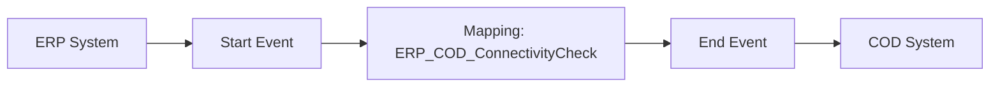

**iFlowId**: Check_Connectivity_from_SAP_Business_Suite_MMZ - **iFlowVersion**: 1.0.3

**Mermaid Diagram**

**Functional Summary**
- **Brief description of the iFlow**
This iFlow performs an end-to-end connectivity check from SAP ERP to SAP Cloud for Customer via SAP Integration Suite.

- **Involved systems with Adapters Type and Endpoint Type**
    - ERP: SOAP Adapter (Sender)
    - COD: SOAP Adapter (Receiver)

- **Key steps**
    1.  Receive SOAP message from ERP system.
    2.  Execute Operation Mapping "ERP_COD_ConnectivityCheck".
    3.  Send SOAP message to COD system.

- **Message transformation**
    - Operation Mapping: ERP_COD_ConnectivityCheck

- **Externalized parameters list and their descriptions**
    - ERP_enableBasicAuthentication_8: Enables basic authentication for the ERP sender adapter.
    - subject: Subject for ERP.
    - issuer: Issuer for ERP.
    - ERP_address_1: Address of the ERP SOAP sender endpoint.
    - ERP_wsdlURL_0: WSDL URL for the ERP SOAP sender endpoint.
    - Host: Hostname for the COD SOAP receiver endpoint.
    - Port: Port for the COD SOAP receiver endpoint.
    - COD_enableBasicAuthentication_6: Enables basic authentication for the COD receiver adapter.
    - artifactname: Credential name for the COD receiver adapter.
    - pr-key-alias: Private key alias for the COD receiver adapter.

- **DataStore / JMS Dependency**
Not Found

- **Cloud Connector Dependency**
Not Found

- **Common Scripts Dependency**
Not Found

- **ProcessDirect ComponentType Dependency**
Not Found