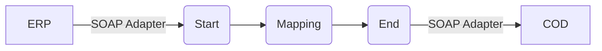

**iFlowId**: Check_Connectivity_from_SAP_Business_Suite_MMZ - **iFlowVersion**: 1.0

**Mermaid Diagram**

**BPMN Diagram**

**Functional Summary**
- **Brief description of the iFlow**
  This iFlow performs an end-to-end connectivity check from SAP ERP to SAP Cloud for Customer (COD) via SAP Integration Suite.

- **Involved systems with Adapters Type and Endpoint Type**
    - ERP (SOAP Adapter, EndpointSender)
    - COD (SOAP Adapter, EndpointRecevier)

- **Key steps**
    1.  Receive SOAP request from ERP.
    2.  Map the request using an Operation Mapping.
    3.  Send SOAP request to COD.

- **Message transformation**
    -  ERP to COD connectivity check request transformation using `ERP_COD_ConnectivityCheck.opmap` operation mapping.

- **Externalized parameters list, configured values and their descriptions**
    -   `COD_enableBasicAuthentication_6`: 0 (Enables basic authentication for the COD receiver channel)
    -   `subject`:  (Subject for some unknown authentication)
    -   `ERP_wsdlURL_0`: /wsdl/ConnectivityCheckConsumer.wsdl (WSDL URL for the ERP sender channel)
    -   `Port`: 443 (Port for the COD receiver channel)
    -   `artifactname`:  (Credential Name for COD)
    -   `ERP_enableBasicAuthentication_8`: true (Enables basic authentication for the ERP sender channel)
    -   `pr-key-alias`:  (Private Key Alias for COD)
    -   `Host`: COD (Host for the COD receiver channel)
    -   `ERP_address_1`: /ERP/COD/SimpleConnect (Address for the ERP sender channel)
    -   `issuer`:  (Issuer for some unknown authentication)

- **DataStore / JMS Dependency**
    Not Found

- **Cloud Connector Dependency**
    Not Found

- **Common Scripts Dependency**
    Not Found

- **ProcessDirect ComponentType Dependency**
    Not Found