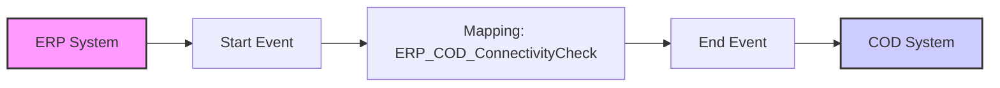

**iFlowId**: Check_Connectivity_from_SAP_Business_Suite_MMZ - **iFlowVersion**: 1.0

**Mermaid Diagram**

**Functional Summary**
**Brief description of the iFlow**
This iFlow performs an end-to-end connectivity check from SAP ERP to SAP Cloud for Customer (C4C) via SAP Integration Suite.

**Involved systems with Adapters Type and Endpoint Type**
- ERP: SOAP Adapter, HTTP Endpoint
- COD (C4C): SOAP Adapter, HTTP Endpoint

**Key steps**
1. The iFlow starts with a message from ERP system via SOAP adapter.
2. The message is then passed to a Mapping step.
3. The mapping step transforms the message to C4C format using the `ERP_COD_ConnectivityCheck` operation mapping.
4. The transformed message is then sent to C4C system via SOAP adapter.

**Message transformation**
- The message is transformed using the `ERP_COD_ConnectivityCheck.opmap` operation mapping to convert the ERP message format to the format expected by C4C.

**Externalized parameters list and their descriptions**
- `ERP_enableBasicAuthentication_8`: Enables basic authentication for the ERP sender channel.
- `subject`: Subject of the certificate for ERP.
- `issuer`: Issuer of the certificate for ERP.
- `ERP_address_1`: Address of the ERP SOAP endpoint.
- `ERP_wsdlURL_0`: WSDL URL of the ERP SOAP endpoint.
- `Host`: Hostname for the COD SOAP endpoint.
- `Port`: Port for the COD SOAP endpoint.
- `COD_enableBasicAuthentication_6`: Enables basic authentication for the COD receiver channel.
- `artifactname`: Credential name for authentication with COD.
- `pr-key-alias`: Private key alias for authentication with COD.

**DataStore / JMS Dependency**
Not Found

**Cloud Connector Dependency**
Not Found

**Common Scripts Dependency**
Not Found

**ProcessDirect ComponentType Dependency**
Not Found