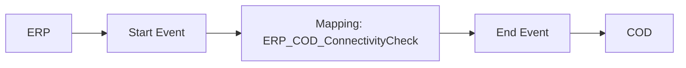

**iFlowId:** Check_Connectivity_from_SAP_Business_Suite_MMZ - **iFlowVersion:** 1.0

**Mermaid Diagram**

**Functional Summary**
- **Brief description of the iFlow**
This iFlow performs an end-to-end connectivity check from SAP ERP to SAP Cloud for Customer via SAP Integration Suite.

- **Involved systems with Adapters Type and Endpoint Type**
  - ERP: SOAP Adapter, HTTP Endpoint
  - COD: SOAP Adapter, HTTP Endpoint

- **Key steps**
 1. The iFlow starts with a message from ERP.
 2. The message is then processed by a Mapping step `ERP_COD_ConnectivityCheck`.
 3. Finally, the message is sent to COD.

- **Message transformation**
  - Mapping: `ERP_COD_ConnectivityCheck`

- **Externalized parameters list and their descriptions**
  - `ERP_enableBasicAuthentication_8`: Enables basic authentication for ERP.
  - `subject`: Subject for ERP authentication.
  - `issuer`: Issuer for ERP authentication.
  - `ERP_address_1`: Address of the ERP system.
  - `ERP_wsdlURL_0`: WSDL URL for ERP.
  - `Host`: Hostname for COD.
  - `Port`: Port number for COD.
  - `COD_enableBasicAuthentication_6`: Enables basic authentication for COD.
  - `artifactname`: Credential name for COD authentication.
  - `pr-key-alias`: Private key alias for COD.

- **DataStore / JMS Dependency**
Not Found

- **Cloud Connector Dependency**
Not Found

- **Common Scripts Dependency**
Not Found

- **ProcessDirect ComponentType Dependency**
Not Found