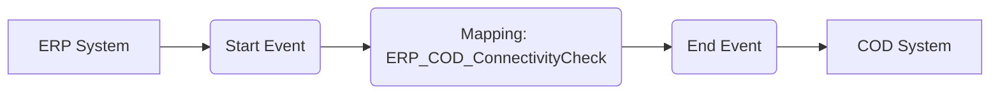

**iFlowId:** Check_Connectivity_from_SAP_Business_Suite_MMZ - **iFlowVersion:** 1.0

**Mermaid Diagram**

**Functional Summary**
- **Brief description of the iFlow**
This iFlow performs an End-to-End connectivity check from SAP ERP to SAP Cloud for Customer via SAP Integration Suite (HCI).

- **Involved systems with Adapters Type and Endpoint Type**
    - ERP: SOAP Adapter, Endpoint Sender
    - COD: SOAP Adapter, Endpoint Receiver

- **Key steps**
    1. The iFlow starts with a message from the ERP system.
    2. A mapping step (`ERP_COD_ConnectivityCheck`) transforms the message.
    3. The message is then sent to the COD system.

- **Message transformation**
    - `ERP_COD_ConnectivityCheck.opmap`

- **Externalized parameters list and their descriptions**
    - `ERP_enableBasicAuthentication_8`:  Enables basic authentication for the ERP sender adapter.
    - `subject`: Subject for ERP sender.
    - `issuer`: Issuer for ERP sender.
    - `ERP_address_1`: Address of the ERP SOAP endpoint.
    - `ERP_wsdlURL_0`: WSDL URL for the ERP SOAP endpoint.
    - `COD_enableBasicAuthentication_6`: Enables basic authentication for the COD receiver adapter.
    - `Host`: Hostname of the COD system.
    - `Port`: Port of the COD system.
    - `artifactname`: Credential name for basic authentication to COD.
    - `pr-key-alias`: Private Key Alias for COD.

- **DataStore / JMS Dependency**
Not Found

- **Cloud Connector Dependency**
Not Found

- **Common Scripts Dependency**
Not Found

- **ProcessDirect ComponentType Dependency**
Not Found