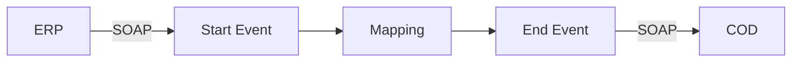
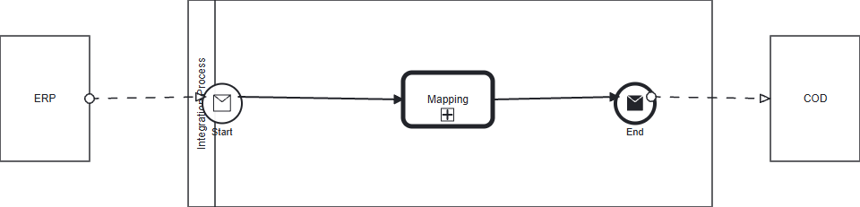

**iFlowId**: Check_Connectivity_from_SAP_Business_Suite_MMZ - **iFlowVersion**: 1.0.3

**Mermaid Diagram**

**BPMN Diagram**

**Functional Summary**
- **Brief description of the iFlow**
    This iFlow performs an end-to-end connectivity check from SAP ERP to SAP Cloud for Customer via SAP Integration Suite.

- **Involved systems with Adapters Type and Endpoint Type**
    - ERP (SOAP Adapter, EndpointSender)
    - COD (SOAP Adapter, EndpointRecevier)

- **Key steps**
    1. Receive message from ERP via SOAP adapter.
    2. Map the message using Operation Mapping (ERP_COD_ConnectivityCheck).
    3. Send message to COD via SOAP adapter.

- **Message transformation**
    - ERP to COD Connectivity Check mapping (ERP_COD_ConnectivityCheck.opmap)

- **Externalized parameters list, configured values and their descriptions**
    - COD_enableBasicAuthentication_6: 0 (Enables/disables basic authentication for COD)
    - subject:  (Subject for authentication)
    - ERP_wsdlURL_0: /wsdl/ConnectivityCheckConsumer.wsdl (WSDL URL for ERP)
    - Port: 443 (Port for COD)
    - artifactname:  (Credential Name for COD authentication)
    - ERP_enableBasicAuthentication_8: true (Enables/disables basic authentication for ERP)
    - pr-key-alias:  (Private Key Alias for COD authentication)
    - Host: COD (Host for COD)
    - ERP_address_1: /ERP/COD/SimpleConnect (Address for ERP)
    - issuer:  (Issuer for authentication)

- **DataStore / JMS Dependency**
    Not Found

- **Cloud Connector Dependency**
    Not Found

- **Common Scripts Dependency**
    Not Found

- **ProcessDirect ComponentType Dependency**
    Not Found