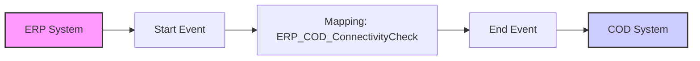

**iFlowId**: Check_Connectivity_from_SAP_Business_Suite_MMZ - **iFlowVersion**: 1.0

**Mermaid Diagram**

**Functional Summary**
- **Brief description of the iFlow**
  This iFlow performs an end-to-end connectivity check from SAP ERP to SAP Cloud for Customer via SAP Integration Suite (HCI).

- **Involved systems with Adapters Type and Endpoint Type**
  - ERP (EndpointSender): SOAP Adapter, HTTP Endpoint
  - COD (EndpointRecevier): SOAP Adapter, HTTP Endpoint

- **Key steps**
  1. Message is sent from ERP via SOAP adapter.
  2. Message is received by the Start Event.
  3. Operation Mapping step: ERP_COD_ConnectivityCheck
  4. Message is sent to COD via SOAP adapter.

- **Message transformation**
  - ERP to COD using Operation Mapping: ERP_COD_ConnectivityCheck

- **Externalized parameters list and their descriptions**
  - ERP_enableBasicAuthentication_8: Enables Basic Authentication for ERP.
  - subject: Subject for ERP.
  - issuer: Issuer for ERP.
  - ERP_address_1: Address of the ERP endpoint.
  - ERP_wsdlURL_0: WSDL URL of the ERP endpoint.
  - Host: Host for COD endpoint.
  - Port: Port for COD endpoint.
  - COD_enableBasicAuthentication_6: Enables Basic Authentication for COD.
  - artifactname: Credential name for COD authentication.
  - pr-key-alias: Private Key Alias for COD authentication.

- **DataStore / JMS Dependency**
  Not Found

- **Cloud Connector Dependency**
  Not Found

- **Common Scripts Dependency**
  Not Found

- **ProcessDirect ComponentType Dependency**
  Not Found