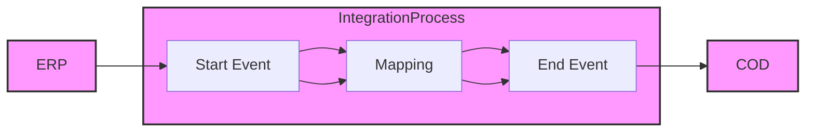

**iFlowId**: Check_Connectivity_from_SAP_Business_Suite_MMZ - **iFlowVersion**: 1.0

**Mermaid Diagram**

**Functional Summary**
- **Brief description of the iFlow**
The iFlow performs an end-to-end connectivity check from SAP ERP to SAP Cloud for Customer (COD) via SAP Integration Suite.

- **Involved systems with Adapters Type and Endpoint Type**
    - ERP: SOAP Adapter, Endpoint Sender
    - COD: SOAP Adapter, Endpoint Receiver

- **Key steps**
    1.  Receive a message from ERP via SOAP adapter.
    2.  Execute an Operation Mapping to transform the message.
    3.  Send the transformed message to COD via SOAP adapter.

- **Message transformation**
    - ERP_COD_ConnectivityCheck.opmap: Maps the message from ERP format to COD format for connectivity check.

- **Externalized parameters list and their descriptions**
    - ERP_enableBasicAuthentication_8: Enables basic authentication for ERP.
    - subject: Subject for ERP.
    - issuer: Issuer for ERP.
    - ERP_address_1: Address of the ERP system's SOAP endpoint.
    - ERP_wsdlURL_0: WSDL URL of the ERP system.
    - Host: Hostname for the COD system.
    - Port: Port number for the COD system.
    - COD_enableBasicAuthentication_6: Enables basic authentication for COD.
    - artifactname: Credential name for COD authentication.
    - pr-key-alias: Private key alias for COD authentication.

- **DataStore / JMS Dependency**
Not Found

- **Cloud Connector Dependency**
Not Found

- **Common Scripts Dependency**
Not Found

- **ProcessDirect ComponentType Dependency**
Not Found