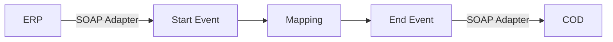

**iFlowId**: Check_Connectivity_from_SAP_Business_Suite_MMZ - **iFlowVersion**: 1.0.3

**Mermaid Diagram**

**Functional Summary**
- **Brief description of the iFlow**
The iFlow performs an end-to-end connectivity check from SAP ERP to SAP Cloud for Customer (COD) via SAP Integration Suite.

- **Involved systems with Adapters Type and Endpoint Type**
  - ERP (EndpointSender) - SOAP Adapter
  - COD (EndpointRecevier) - SOAP Adapter

- **Key steps**
 1. Receive request from ERP system via SOAP adapter.
 2. Perform message mapping using the `ERP_COD_ConnectivityCheck` operation mapping.
 3. Send the mapped message to COD system via SOAP adapter.

- **Message transformation**
  - The iFlow uses the `ERP_COD_ConnectivityCheck` operation mapping to transform the message between the ERP and COD systems. The mapping file path is `dir://opmap/src/main/resources/mapping/ERP_COD_ConnectivityCheck.opmap`.

- **Externalized parameters list and their descriptions**
  - `ERP_enableBasicAuthentication_8`: Enables basic authentication for the ERP sender adapter.
  - `subject`: Subject for the ERP sender adapter.
  - `issuer`: Issuer for the ERP sender adapter.
  - `ERP_address_1`: Address of the ERP system SOAP endpoint.
  - `ERP_wsdlURL_0`: WSDL URL of the ERP system SOAP endpoint.
  - `Host`: Hostname for the COD system SOAP endpoint.
  - `Port`: Port for the COD system SOAP endpoint.
  - `COD_enableBasicAuthentication_6`: Enables basic authentication for the COD receiver adapter.
  - `artifactname`: Credential name for the COD receiver adapter.
  - `pr-key-alias`: Private key alias for the COD receiver adapter.

- **DataStore / JMS Dependency**
Not Found

- **Cloud Connector Dependency**
Not Found

- **Common Scripts Dependency**
Not Found

- **ProcessDirect ComponentType Dependency**
Not Found