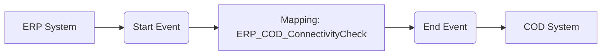

**iFlowId**: Check_Connectivity_from_SAP_Business_Suite_MMZ - **iFlowVersion**: 1.0

**Mermaid Diagram**

**Functional Summary**
- **Brief description of the iFlow**
  This iFlow performs an end-to-end connectivity check from SAP ERP to SAP Cloud for Customer (COD) via SAP Integration Suite.

- **Involved systems with Adapters Type and Endpoint Type**
  - ERP (SOAP Sender Adapter, HTTP Endpoint)
  - COD (SOAP Receiver Adapter, HTTP Endpoint)

- **Key steps**
 1. The iFlow starts with a message from the ERP system.
 2. The message is mapped using an Operation Mapping.
 3. The mapped message is sent to the COD system.

- **Message transformation**
  -  ERP to COD: The message is transformed using the "ERP_COD_ConnectivityCheck" operation mapping.

- **Externalized parameters list and their descriptions**
  - `ERP_enableBasicAuthentication_8`: Enables Basic Authentication for ERP Sender Adapter.
  - `subject`: Subject for the ERP Sender Adapter.
  - `issuer`: Issuer for the ERP Sender Adapter.
  - `ERP_address_1`: Address of the ERP system.
  - `ERP_wsdlURL_0`: WSDL URL of the ERP system.
  - `Host`: Hostname for COD.
  - `Port`: Port for COD.
  - `COD_enableBasicAuthentication_6`: Enables Basic Authentication for COD Receiver Adapter.
  - `artifactname`: Credential name for COD.
  - `pr-key-alias`: Private Key Alias for COD.

- **DataStore / JMS Dependency**
  Not Found

- **Cloud Connector Dependency**
  Not Found

- **Common Scripts Dependency**
  Not Found

- **ProcessDirect ComponentType Dependency**
  Not Found