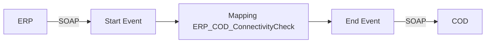

**iFlowId**: Check_Connectivity_from_SAP_Business_Suite_MMZ - **iFlowVersion**: 1.0

**Mermaid Diagram**

**BPMN Diagram**

**Functional Summary**
- **Brief description of the iFlow**
This iFlow performs an end-to-end connectivity check from SAP ERP to SAP Cloud for Customer (COD) via SAP Integration Suite.

- **Involved systems with Adapters Type and Endpoint Type**
    - ERP (SOAP, EndpointSender)
    - COD (SOAP, EndpointRecevier)

- **Key steps**
    1. Receive a SOAP request from ERP.
    2. Map the request using operation mapping `ERP_COD_ConnectivityCheck`.
    3. Send a SOAP request to COD.

- **Message transformation**
    - Operation Mapping: ERP_COD_ConnectivityCheck

- **Externalized parameters list, configured values and their descriptions**
    - COD_enableBasicAuthentication_6: 0 (Enable Basic Authentication for COD endpoint)
    - subject:  (Subject for authentication)
    - ERP_wsdlURL_0: /wsdl/ConnectivityCheckConsumer.wsdl (WSDL URL for ERP endpoint)
    - Port: 443 (Port for COD endpoint)
    - artifactname:  (Credential Name for COD endpoint)
    - ERP_enableBasicAuthentication_8: true (Enable Basic Authentication for ERP endpoint)
    - pr-key-alias:  (Private Key Alias for COD endpoint)
    - Host: COD (Host for COD endpoint)
    - ERP_address_1: /ERP/COD/SimpleConnect (Address for ERP endpoint)
    - issuer:  (Issuer for authentication)

- **DataStore / JMS Dependency**
Not Found

- **Cloud Connector Dependency**
Not Found

- **Common Scripts Dependency**
Not Found

- **ProcessDirect ComponentType Dependency**
Not Found