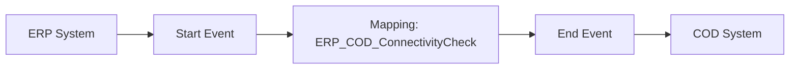

**iFlowId**: Check_Connectivity_from_SAP_Business_Suite_MMZ - **iFlowVersion**: 1.0

**Mermaid Diagram**

**Functional Summary**
- **Brief description of the iFlow**
This iFlow performs an end-to-end connectivity check from SAP ERP to SAP Cloud for Customer (C4C) via SAP Integration Suite.

- **Involved systems with Adapters Type and Endpoint Type**
    - ERP: SOAP Adapter (Sender)
    - COD: SOAP Adapter (Receiver)

- **Key steps**
    1.  The iFlow starts with a message from the ERP system.
    2.  A mapping step `ERP_COD_ConnectivityCheck` transforms the message.
    3.  The transformed message is sent to the COD system.

- **Message transformation**
    - `ERP_COD_ConnectivityCheck` operation mapping is used.

- **Externalized parameters list and their descriptions**
    - `ERP_enableBasicAuthentication_8`: Enables basic authentication for ERP endpoint.
    - `subject`: Subject for ERP endpoint.
    - `issuer`: Issuer for ERP endpoint.
    - `ERP_address_1`: Address of the ERP endpoint.
    - `ERP_wsdlURL_0`: WSDL URL for the ERP endpoint.
    - `Host`: Hostname for the COD endpoint.
    - `Port`: Port for the COD endpoint.
    - `COD_enableBasicAuthentication_6`: Enables basic authentication for COD endpoint.
    - `artifactname`: Credential name for COD endpoint authentication.
    - `pr-key-alias`: Private key alias for COD endpoint.

- **DataStore / JMS Dependency**
Not Found

- **Cloud Connector Dependency**
Not Found

- **Common Scripts Dependency**
Not Found

- **ProcessDirect ComponentType Dependency**
Not Found