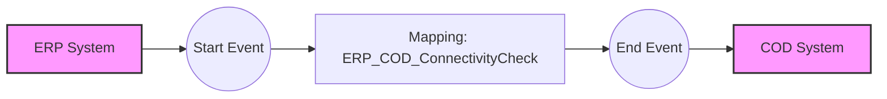

**iFlowId**: Check_Connectivity_from_SAP_Business_Suite_MMZ - **iFlowVersion**: 1.0

**Mermaid Diagram**
- **Visual representation of the flow**

**Functional Summary**
- **Brief description of the iFlow**
This iFlow performs an end-to-end connectivity check from SAP ERP to SAP Cloud for Customer via SAP Integration Suite.

- **Involved systems with Adapters Type and Endpoint Type**
    - ERP: SOAP adapter, Endpoint Sender
    - COD: SOAP adapter, Endpoint Receiver

- **Key steps**
    1. The iFlow is triggered by a message from the ERP system via SOAP.
    2. A mapping step (`ERP_COD_ConnectivityCheck.opmap`) transforms the message.
    3. The iFlow sends the transformed message to the COD system via SOAP.

- **Message transformation**
    - Mapping `ERP_COD_ConnectivityCheck.opmap` is used to transform the message from the ERP format to the COD format.

- **Externalized parameters list and their descriptions**
    - `ERP_enableBasicAuthentication_8`: Enables basic authentication for the ERP sender adapter.
    - `subject`: Subject for the ERP sender adapter.
    - `issuer`: Issuer for the ERP sender adapter.
    - `ERP_address_1`: Address for the ERP sender SOAP adapter.
    - `ERP_wsdlURL_0`: WSDL URL for the ERP sender SOAP adapter.
    - `Host`: Hostname for the COD receiver SOAP adapter.
    - `Port`: Port for the COD receiver SOAP adapter.
    - `COD_enableBasicAuthentication_6`: Enables basic authentication for the COD receiver adapter.
    - `artifactname`: Credential name for the COD receiver SOAP adapter.
    - `pr-key-alias`: Private Key Alias for the COD receiver SOAP adapter.

- **DataStore / JMS Dependency**
Not Found

- **Cloud Connector Dependency**
Not Found

- **Common Scripts Dependency**
Not Found

- **ProcessDirect ComponentType Dependency**
Not Found