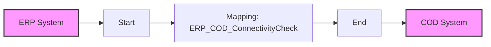

**iFlowId**: Check_Connectivity_from_SAP_Business_Suite_MMZ - **iFlowVersion**: 1.0

**Mermaid Diagram**

**Functional Summary**
- **Brief description of the iFlow**
  This iFlow performs an end-to-end connectivity check from SAP ERP to SAP Cloud for Customer (C4C) via SAP Integration Suite.

- **Involved systems with Adapters Type and Endpoint Type**
    - ERP (EndpointSender): SOAP Adapter (HTTP, Plain SOAP)
    - COD (EndpointRecevier): SOAP Adapter (HTTP, Plain SOAP)

- **Key steps**
1.  Receive SOAP message from ERP system via SOAP adapter.
2.  Perform message mapping using operation mapping "ERP_COD_ConnectivityCheck"
3.  Send SOAP message to COD system via SOAP adapter.

- **Message transformation**
    - ERP to COD via the operation mapping "ERP_COD_ConnectivityCheck"

- **Externalized parameters list and their descriptions**
    - ERP_enableBasicAuthentication_8: Enables basic authentication for the ERP sender adapter.
    - subject: Subject for ERP
    - issuer: Issuer for ERP
    - ERP_address_1: Address of the ERP endpoint.
    - ERP_wsdlURL_0: WSDL URL of the ERP endpoint.
    - Host: Hostname for COD endpoint.
    - Port: Port for COD endpoint.
    - COD_enableBasicAuthentication_6: Enables basic authentication for the COD receiver adapter.
    - artifactname: Credential name for COD.
    - pr-key-alias: Private key alias for COD.

- **DataStore / JMS Dependency**
  Not Found

- **Cloud Connector Dependency**
  Not Found

- **Common Scripts Dependency**
  Not Found

- **ProcessDirect ComponentType Dependency**
  Not Found