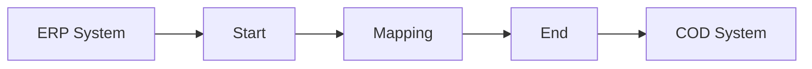

**iFlowId:** Check_Connectivity_from_SAP_Business_Suite_MMZ - **iFlowVersion:** 1.0

**Mermaid Diagram**
- **Visual representation of the flow**

**Functional Summary**
- **Brief description of the iFlow**
  This iFlow performs an end-to-end connectivity check from SAP ERP to SAP Cloud for Customer via SAP Integration Suite.

- **Involved systems with Adapters Type and Endpoint Type**
  - ERP (Sender): SOAP Adapter (HTTP)
  - COD (Receiver): SOAP Adapter (HTTP)

- **Key steps**
  1. The iFlow starts with a message from the ERP system.
  2. An Operation Mapping transforms the message.
  3. The message is sent to the COD system.

- **Message transformation**
  - ERP_COD_ConnectivityCheck.opmap (Operation Mapping)

- **Externalized parameters list and their descriptions**
  - ERP_enableBasicAuthentication_8: Enables basic authentication for the ERP sender adapter.
  - subject: Subject for ERP sender.
  - issuer: Issuer for ERP sender.
  - ERP_address_1: Address of the ERP system.
  - ERP_wsdlURL_0: WSDL URL of the ERP system.
  - Host: Hostname for the COD receiver.
  - Port: Port for the COD receiver.
  - COD_enableBasicAuthentication_6: Enables basic authentication for the COD receiver adapter.
  - artifactname: Credential name for the COD receiver adapter.
  - pr-key-alias: Private key alias for the COD receiver adapter.

- **DataStore / JMS Dependency**
  Not Found

- **Cloud Connector Dependency**
  Not Found

- **Common Scripts Dependency**
  Not Found

- **ProcessDirect ComponentType Dependency**
  Not Found