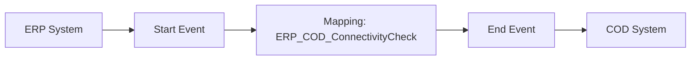

**iFlowId**: Check_Connectivity_from_SAP_Business_Suite_MMZ - **iFlowVersion**: 1.0.3

**Mermaid Diagram**

**Functional Summary**
- **Brief description of the iFlow**
This iFlow performs an end-to-end connectivity check from SAP ERP to SAP Cloud for Customer (C4C) via SAP Integration Suite.

- **Involved systems with Adapters Type and Endpoint Type**
    - ERP: SOAP Sender Adapter, EndpointSender
    - COD: SOAP Receiver Adapter, EndpointRecevier

- **Key steps**
1.  Receive message from ERP via SOAP sender adapter.
2.  Map the message using an Operation Mapping (ERP_COD_ConnectivityCheck).
3.  Send message to COD via SOAP receiver adapter.

- **Message transformation**
    - Operation Mapping: ERP_COD_ConnectivityCheck

- **Externalized parameters list and their descriptions**
    - ERP_enableBasicAuthentication_8: Enables basic authentication for the ERP sender adapter.
    - subject: Subject for ERP endpoint.
    - issuer: Issuer for ERP endpoint.
    - ERP_address_1: Address of the ERP SOAP service.
    - ERP_wsdlURL_0: WSDL URL of the ERP SOAP service.
    - Host: Hostname for the COD receiver address.
    - Port: Port for the COD receiver address.
    - COD_enableBasicAuthentication_6: Enables basic authentication for the COD receiver adapter.
    - artifactname: Credential name for COD authentication.
    - pr-key-alias: Private key alias for COD authentication.

- **DataStore / JMS Dependency**
Not Found

- **Cloud Connector Dependency**
Not Found

- **Common Scripts Dependency**
Not Found

- **ProcessDirect ComponentType Dependency**
Not Found