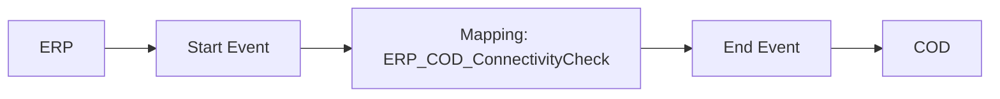

**iFlowId**: Check_Connectivity_from_SAP_Business_Suite_MMZ - **iFlowVersion**: 1.0

**Mermaid Diagram**

**Functional Summary**
- **Brief description of the iFlow**
This iFlow performs an end-to-end connectivity check from SAP ERP to SAP Cloud for Customer (C4C) via SAP Integration Suite (HCI).

- **Involved systems with Adapters Type and Endpoint Type**
    - ERP: SOAP Adapter, HTTP Endpoint
    - COD: SOAP Adapter, HTTP Endpoint

- **Key steps**
    1.  The iFlow starts with a message from ERP system, triggered by a SOAP call.
    2.  The message is passed to a mapping step.
    3.  The mapping "ERP_COD_ConnectivityCheck" transforms the message.
    4.  The message is sent to the COD system via SOAP.

- **Message transformation**
    - Mapping: ERP_COD_ConnectivityCheck

- **Externalized parameters list and their descriptions**
    - ERP_enableBasicAuthentication_8: Enables basic authentication for the ERP sender adapter.
    - subject: Subject for ERP.
    - issuer: Issuer for ERP.
    - ERP_address_1: Address of the ERP SOAP endpoint.
    - ERP_wsdlURL_0: WSDL URL of the ERP SOAP service.
    - Host: Hostname for the COD SOAP endpoint URL.
    - Port: Port for the COD SOAP endpoint URL.
    - COD_enableBasicAuthentication_6: Enables basic authentication for the COD receiver adapter.
    - artifactname: Credential name for COD.
    - pr-key-alias: Private key alias for COD.

- **DataStore / JMS Dependency**
Not Found

- **Cloud Connector Dependency**
Not Found

- **Common Scripts Dependency**
Not Found

- **ProcessDirect ComponentType Dependency**
Not Found