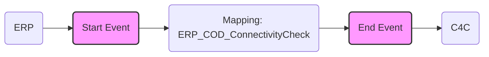

**iFlowId**: Check_Connectivity_from_SAP_Business_Suite_MMZ - **iFlowVersion**: 1.0.3

**Functional Summary**

- **Brief description of the iFlow**
This iFlow performs an end-to-end connectivity check from SAP ERP to SAP Cloud for Customer (C4C) via SAP Integration Suite (formerly HCI).

- **Involved systems**
  - SAP ERP
  - SAP Cloud for Customer (C4C/COD)

- **Used Adapters**
  - SOAP (for both ERP and C4C)

- **Key steps**
 i. An inbound SOAP message is received from the SAP ERP system.
 ii. An operation mapping transforms the message. The mapping name is ERP_COD_ConnectivityCheck.
iii. An outbound SOAP message is sent to the SAP Cloud for Customer system.

- **Message transformation**
   - ERP_COD_ConnectivityCheck.opmap (Operation Mapping)

- **Externalized parameters list and their descriptions**
  - ERP_enableBasicAuthentication_8: Enables basic authentication for the ERP sender adapter (boolean, possible values true/false, is likely defaulted to false if not configured explicitly).
  - subject: Subject for ERP communication
  - issuer: Issuer for ERP communication
  - ERP_address_1: Address/Endpoint URL of the ERP SOAP sender.
  - ERP_wsdlURL_0: WSDL URL of the ERP SOAP sender.
  - Host: Hostname for C4C communication
  - Port: Port for C4C communication
  - COD_enableBasicAuthentication_6: Enables basic authentication for the C4C receiver adapter.
  - artifactname: Credential name (likely for basic authentication) for the C4C receiver adapter.
  - pr-key-alias: Private key alias for C4C communication.

- **DataStore / JMS Dependency**
Not Found

**Mermaid Diagram**

