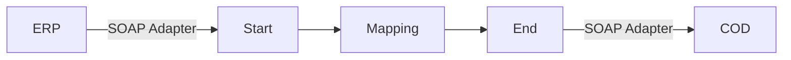

**iFlowId:** Check_Connectivity_from_SAP_Business_Suite_MMZ - **iFlowVersion:** 1.0.3

**Mermaid Diagram**

**BPMN Diagram**

**Functional Summary**
-   **Brief description of the iFlow**
    Performs End2End connectivity check from SAP ERP to SAP Cloud for Customer.

-   **Involved systems with Adapters Type and Endpoint Type**
    -   ERP (SOAP, EndpointSender)
    -   COD (SOAP, EndpointRecevier)

-   **Key steps**
    1.  Receive request from ERP via SOAP adapter.
    2.  Map the message using Operation Mapping (ERP\_COD\_ConnectivityCheck).
    3.  Send the message to COD via SOAP adapter.

-   **Message transformation**
    -   Operation Mapping: ERP\_COD\_ConnectivityCheck

-   **Externalized parameters list, configured values and their descriptions**
    -   COD\_enableBasicAuthentication\_6: 0 (Not specified description)
    -   subject:  (Not specified description)
    -   ERP\_wsdlURL\_0: /wsdl/ConnectivityCheckConsumer.wsdl (Not specified description)
    -   Port: 443 (Not specified description)
    -   artifactname:  (Not specified description)
    -   ERP\_enableBasicAuthentication\_8: true (Not specified description)
    -   pr-key-alias:  (Not specified description)
    -   Host: COD (Not specified description)
    -   ERP\_address\_1: /ERP/COD/SimpleConnect (Not specified description)
    -   issuer:  (Not specified description)

-   **DataStore / JMS Dependency**
    Not Found

-   **Cloud Connector Dependency**
    Not Found

-   **Common Scripts Dependency**
    Not Found

-   **ProcessDirect ComponentType Dependency**
    Not Found