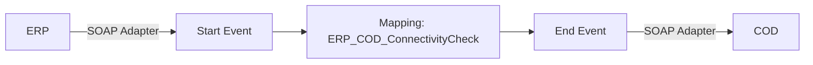

**iFlowId**: Check_Connectivity_from_SAP_Business_Suite_MMZ - **iFlowVersion**: 1.0.3

**Mermaid Diagram**

**BPMN Diagram**

**Functional Summary**
-   **Brief description of the iFlow**
    This iFlow performs an end-to-end connectivity check from SAP ERP to SAP Cloud for Customer via SAP Integration Suite.
-   **Involved systems with Adapters Type and Endpoint Type**
    -   ERP (SOAP, EndpointSender)
    -   COD (SOAP, EndpointRecevier)
-   **Key steps**
    1.  Receive SOAP message from ERP.
    2.  Map the message using Operation Mapping "ERP\_COD\_ConnectivityCheck".
    3.  Send SOAP message to COD.
-   **Message transformation**
    -   ERP to COD using Operation Mapping: ERP\_COD\_ConnectivityCheck.opmap
-   **Externalized parameters list, configured values and their descriptions**
    -   COD\_enableBasicAuthentication\_6: 0
    -   subject:
    -   ERP\_wsdlURL\_0: /wsdl/ConnectivityCheckConsumer.wsdl
    -   Port: 443
    -   artifactname:
    -   ERP\_enableBasicAuthentication\_8: true
    -   pr-key-alias:
    -   Host: COD
    -   ERP\_address\_1: /ERP/COD/SimpleConnect
    -   issuer:
-   **DataStore / JMS Dependency**
    Not Found
-   **Cloud Connector Dependency**
    Not Found
-   **Common Scripts Dependency**
    Not Found
-   **ProcessDirect ComponentType Dependency**
    Not Found