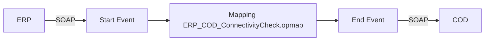

**iFlowId**: Check_Connectivity_from_SAP_Business_Suite_MMZ - **iFlowVersion**: 1.0.3

**Mermaid Diagram**

**BPMN Diagram**

**Functional Summary**
- **Brief description of the iFlow**
  This iFlow performs an End2End connectivity check from SAP ERP to SAP Cloud for Customer (COD) via SAP Integration Suite.

- **Involved systems with Adapters Type and Endpoint Type**
    - ERP (SOAP, EndpointSender)
    - COD (SOAP, EndpointRecevier)

- **Key steps**
    1. Receive SOAP request from ERP.
    2. Perform a mapping using `ERP_COD_ConnectivityCheck.opmap`.
    3. Send SOAP request to COD.

- **Message transformation**
    - `ERP_COD_ConnectivityCheck.opmap`

- **Externalized parameters list, configured values and their descriptions**
    - `COD_enableBasicAuthentication_6`: 0 (No description provided)
    - `subject`:  (No description provided)
    - `ERP_wsdlURL_0`: /wsdl/ConnectivityCheckConsumer.wsdl (No description provided)
    - `Port`: 443 (No description provided)
    - `artifactname`:  (No description provided)
    - `ERP_enableBasicAuthentication_8`: true (No description provided)
    - `pr-key-alias`: (No description provided)
    - `Host`: COD (No description provided)
    - `ERP_address_1`: /ERP/COD/SimpleConnect (No description provided)
    - `issuer`: (No description provided)

- **DataStore / JMS Dependency**
  Not Found

- **Cloud Connector Dependency**
  Not Found

- **Common Scripts Dependency**
  Not Found

- **ProcessDirect ComponentType Dependency**
  Not Found