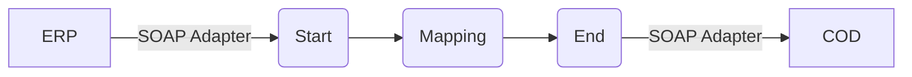

**iFlowId**: Check_Connectivity_from_SAP_Business_Suite_MMZ - **iFlowVersion**: 1.0

**Mermaid Diagram**

**BPMN Diagram**

**Functional Summary**
- **Brief description of the iFlow**
This iFlow performs an End-to-End connectivity check from SAP ERP to SAP Cloud for Customer via SAP Integration Suite.

- **Involved systems with Adapters Type and Endpoint Type**
    - ERP: SOAP Adapter, EndpointSender
    - COD: SOAP Adapter, EndpointRecevier

- **Key steps**
    1.  Receive message from ERP system via SOAP adapter.
    2.  Map the message using the `ERP_COD_ConnectivityCheck` operation mapping.
    3.  Send message to COD system via SOAP adapter.

- **Message transformation**
    - Operation Mapping: `ERP_COD_ConnectivityCheck` (src/main/resources/mapping/ERP_COD_ConnectivityCheck)

- **Externalized parameters list, configured values and their descriptions**
    - `COD_enableBasicAuthentication_6`: `0` (Enable Basic Authentication for COD)
    - `subject`: `` (Subject)
    - `ERP_wsdlURL_0`: `/wsdl/ConnectivityCheckConsumer.wsdl` (ERP WSDL URL)
    - `Port`: `443` (Port for COD)
    - `artifactname`: `` (Credential Name for COD)
    - `ERP_enableBasicAuthentication_8`: `true` (Enable Basic Authentication for ERP)
    - `pr-key-alias`: `` (Private Key Alias)
    - `Host`: `COD` (Host for COD)
    - `ERP_address_1`: `/ERP/COD/SimpleConnect` (ERP Address)
    - `issuer`: `` (Issuer)

- **DataStore / JMS Dependency**
Not Found

- **Cloud Connector Dependency**
Not Found

- **Common Scripts Dependency**
Not Found

- **ProcessDirect ComponentType Dependency**
Not Found