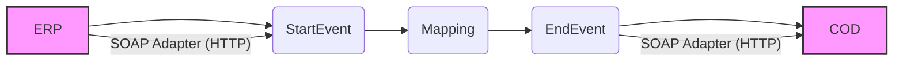

**iFlowId**: Check_Connectivity_from_SAP_Business_Suite_MMZ - **iFlowVersion**: 1.0

**Mermaid Diagram**

**BPMN Diagram**

**Functional Summary**
-   **Brief description of the iFlow**
    This iFlow performs an end-to-end connectivity check from SAP ERP to SAP Cloud for Customer (COD) via SAP Integration Suite.

-   **Involved systems with Adapters Type and Endpoint Type**
    -   ERP (EndpointSender): SOAP Adapter (HTTP)
    -   COD (EndpointRecevier): SOAP Adapter (HTTP)

-   **Key steps**
    1.  Receive SOAP message from ERP.
    2.  Perform an Operation Mapping (ERP_COD_ConnectivityCheck) to transform the message.
    3.  Send SOAP message to COD.

-   **Message transformation**
    -   Mapping: ERP_COD_ConnectivityCheck (dir://opmap/src/main/resources/mapping/ERP_COD_ConnectivityCheck.opmap)

-   **Externalized parameters list, configured values and their descriptions**
    -   COD_enableBasicAuthentication_6: 0 (Enable Basic Authentication for COD)
    -   subject:  (Subject)
    -   ERP_wsdlURL_0: /wsdl/ConnectivityCheckConsumer.wsdl (WSDL URL for ERP)
    -   Port: 443 (Port for COD)
    -   artifactname:  (Credential Name for COD)
    -   ERP_enableBasicAuthentication_8: true (Enable Basic Authentication for ERP)
    -   pr-key-alias:  (Private Key Alias)
    -   Host: COD (Host for COD)
    -   ERP_address_1: /ERP/COD/SimpleConnect (Address for ERP)
    -   issuer:  (Issuer)

-   **DataStore / JMS Dependency**
    Not Found

-   **Cloud Connector Dependency**
    Not Found

-   **Common Scripts Dependency**
    Not Found

-   **ProcessDirect ComponentType Dependency**
    Not Found