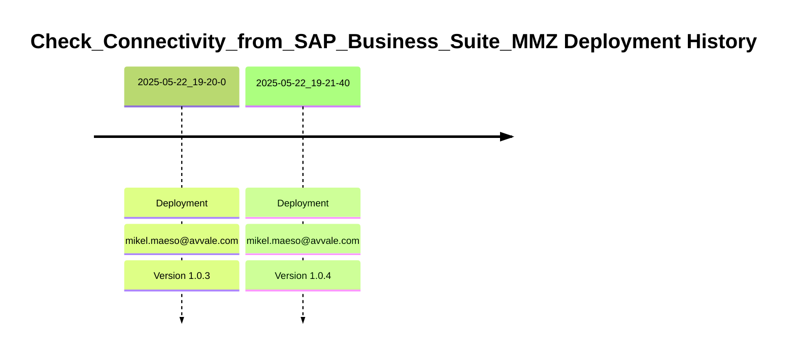

# Integration Flow: Check_Connectivity_from_SAP_Business_Suite_MMZ

This document provides an overview, deployment history, and links to specific versions for the integration flow `Check_Connectivity_from_SAP_Business_Suite_MMZ`.

## Deployment History
<!-- DEPLOYMENT_TIMELINE_START -->

<!-- DEPLOYMENT_TIMELINE_END -->

## Available Versions
<!-- VERSION_LINKS_START -->
- [Version 1.0.4 (Deployed: 2025-05-22 19:21:40 CEST CEST)](./1.0.4/readme.md)
- [Version 1.0.3 (Deployed: 2025-05-22 19:20:00 CEST CEST)](./1.0.3/readme.md)
<!-- VERSION_LINKS_END -->