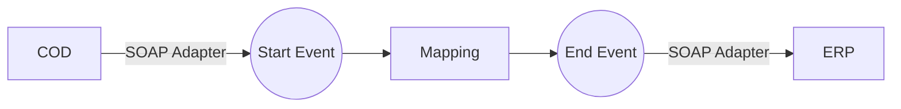

**iFlowId**: Check_Connectivity_to_SAP_Business_Suite_MMZ - **iFlowVersion**: 1.0.4

**Mermaid Diagram**

**Functional Summary**
- **Brief description of the iFlow**
This iFlow performs an end-to-end connectivity check from SAP Cloud for Customer (COD) to SAP ERP via SAP Integration Suite.

- **Involved systems with Adapters Type and Endpoint Type**
  - COD: SOAP Adapter, EndpointSender
  - ERP: SOAP Adapter, EndpointRecevier

- **Key steps**
  1. Receive request from COD via SOAP adapter.
  2. Execute message mapping (`COD_ERP_CheckEnd2EndConnectivity.opmap`).
  3. Send the mapped message to ERP via SOAP adapter.

- **Message transformation**
  - The iFlow uses the `COD_ERP_CheckEnd2EndConnectivity.opmap` mapping to transform the message.

- **Externalized parameters list, configured values and their descriptions**
  - `ERP_authentication_5`: Configured value: `Client Certificate`. Description: Authentication type for ERP connection.
  - `Protocol-Hostname-Port`: Configured value: `https://erphost:443`. Description: Protocol, hostname and port of the ERP system.
  - `subject`: Configured value: `cn=subject`. Description: Subject for the client certificate.
  - `artifactname`: Configured value: ``. Description: Artifact name for the credential.
  - `p-key-alias`: Configured value: ``. Description: Private key alias.
  - `ERP_allowChunking_3`: Configured value: `1`. Description: Allow Chunking for ERP connection.
  - `issuer`: Configured value: `cn=issuer`. Description: Issuer for the client certificate.
  - `ERP_proxyType_4`: Configured value: `default`. Description: Proxy type for ERP connection.
  - `COD_enableBasicAuthentication_3`: Configured value: `true`. Description: Enable Basic Authentication for COD connection.
  - `COD_wsdlURL_1`: Configured value: `/wsdl/CheckConnectivityConsumer.wsdl`. Description: WSDL URL for COD connection.
  - `ERP_cleanupHeaders_2`: Configured value: `1`. Description: Clean up headers for ERP connection.
  - `location-id`: Configured value: ``. Description: Location ID.
  - `Client`: Configured value: `100`. Description: Client number for ERP connection.
  - `COD_address_2`: Configured value: `/COD/ERP/SimpleConnect`. Description: Address for COD connection.

- **DataStore / JMS Dependency**
Not Found

- **Cloud Connector Dependency**
Not Found

- **Common Scripts Dependency**
Not Found

- **ProcessDirect ComponentType Dependency**
Not Found