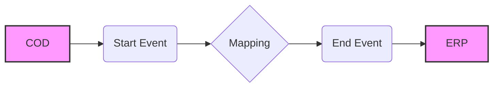

**iFlowId**: Check_Connectivity_to_SAP_Business_Suite_MMZ - **iFlowVersion**: 1.0.4

**Functional Summary**

**Brief description of the iFlow**
This iFlow performs an end-to-end connectivity check from SAP Cloud for Customer (C4C/COD) to SAP ERP via SAP Integration Suite (formerly HCI).

**Involved systems**
- COD (SAP Cloud for Customer)
- ERP (SAP ERP)

**Used Adapters**
- SOAP

**Key steps**
i.  The iFlow starts with a message received from the COD system.
ii. A mapping step transforms the message (COD_ERP_CheckEnd2EndConnectivity.opmap).
iii. The transformed message is then sent to the ERP system.

**Message transformation**
- COD_ERP_CheckEnd2EndConnectivity.opmap is used to transform the message.

**Externalized parameters list and their descriptions**
- `{{COD_enableBasicAuthentication_3}}`: Enables basic authentication for the COD endpoint.
- `{{subject}}`: Subject for authentication at COD endpoint
- `{{issuer}}`: Issuer for authentication at COD endpoint
- `{{COD_address_2}}`: Address of the COD endpoint.
- `{{COD_wsdlURL_1}}`: WSDL URL for the COD endpoint.
- `{{Protocol-Hostname-Port}}`: Protocol, hostname and port of the ERP endpoint.
- `{{Client}}`: Client for the ERP endpoint.
- `{{ERP_proxyType_4}}`: Proxy type for the ERP endpoint.
- `{{location-id}}`: Location ID for the ERP endpoint.
- `{{ERP_authentication_5}}`: Authentication type for the ERP endpoint.
- `{{artifactname}}`: Credential name for ERP authentication.
- `{{ERP_allowChunking_3}}`: Allows chunking for the ERP endpoint.
- `{{ERP_cleanupHeaders_2}}`: Cleans up headers for the ERP endpoint.
- `{{p-key-alias}}`: Private Key Alias for ERP WS Security.

**DataStore / JMS Dependency**
Not Found

**Mermaid Diagram**

