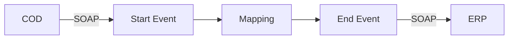

**iFlowId**: Check_Connectivity_to_SAP_Business_Suite_MMZ - **iFlowVersion**: 1.0.4

**Mermaid Diagram**

**BPMN Diagram**

**Functional Summary**
- **Brief description of the iFlow**
This iFlow performs an end-to-end connectivity check from SAP Cloud for Customer (COD) to SAP ERP via SAP Integration Suite.

- **Involved systems with Adapters Type and Endpoint Type**
    - COD: SOAP, EndpointSender
    - ERP: SOAP, EndpointRecevier

- **Key steps**
    1. Receive SOAP request from COD.
    2. Execute a mapping to transform the message.
    3. Send SOAP request to ERP.

- **Message transformation**
    - Mapping: COD_ERP_CheckEnd2EndConnectivity.opmap

- **Externalized parameters list, configured values and their descriptions**
    - COD_enableBasicAuthentication_3=true
    - subject=cn=subject
    - issuer=cn=issuer
    - COD_address_2=/COD/ERP/SimpleConnect
    - COD_wsdlURL_1=/wsdl/CheckConnectivityConsumer.wsdl
    - ERP_allowChunking_3=1
    - ERP_authentication_5=Client Certificate
    - Protocol-Hostname-Port=https://erphost:443
    - Client=100
    - artifactname=
    - p-key-alias=
    - ERP_proxyType_4=default
    - ERP_cleanupHeaders_2=1
    - location-id=

- **DataStore / JMS Dependency**
Not Found

- **Cloud Connector Dependency**
Not Found

- **Common Scripts Dependency**
Not Found

- **ProcessDirect ComponentType Dependency**
Not Found