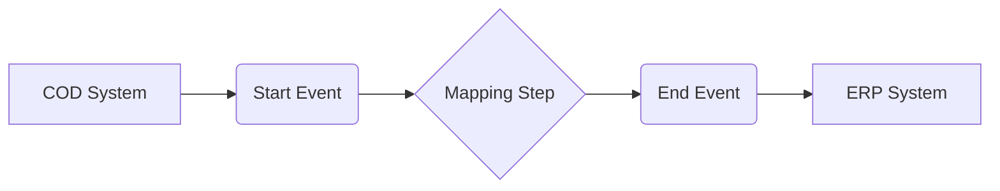

**iFlowId**: Check_Connectivity_to_SAP_Business_Suite_MMZ - **iFlowVersion**: 1.0.4

**Mermaid Diagram**

**Functional Summary**
- **Brief description of the iFlow**
This iFlow performs an end-to-end connectivity check from SAP Cloud for Customer (C4C/COD) to SAP ERP via SAP Integration Suite (HCI/CPI).

- **Involved systems with Adapters Type and Endpoint Type**
    - COD: SOAP Adapter, EndpointSender
    - ERP: SOAP Adapter, EndpointRecevier

- **Key steps**
    1.  The iFlow is triggered by a SOAP call from COD.
    2.  A mapping step (COD_ERP_CheckEnd2EndConnectivity.opmap) transforms the message.
    3.  The transformed message is sent to ERP via SOAP.

- **Message transformation**
    -  The iFlow uses a mapping (COD_ERP_CheckEnd2EndConnectivity.opmap) to transform the message between COD and ERP.

- **Externalized parameters list and their descriptions**
    - COD_enableBasicAuthentication_3: Enables basic authentication for COD endpoint.
    - subject: Subject for COD endpoint.
    - issuer: Issuer for COD endpoint.
    - COD_address_2: Address of the COD endpoint.
    - COD_wsdlURL_1: WSDL URL of the COD endpoint.
    - Protocol-Hostname-Port: Protocol, Hostname and Port of the ERP endpoint.
    - Client: Client for the ERP endpoint.
    - ERP_proxyType_4: Proxy type for the ERP endpoint.
    - location-id: Location ID for ERP endpoint.
    - ERP_authentication_5: Authentication method for the ERP endpoint.
    - artifactname: Credential name for ERP authentication.
    - ERP_allowChunking_3: Allows chunking for ERP endpoint.
    - ERP_cleanupHeaders_2: Cleans up headers for ERP endpoint.
    - p-key-alias: Private key alias for ERP endpoint.

- **DataStore / JMS Dependency**
Not Found

- **Cloud Connector Dependency**
Not Found

- **Common Scripts Dependency**
Not Found

- **ProcessDirect ComponentType Dependency**
Not Found