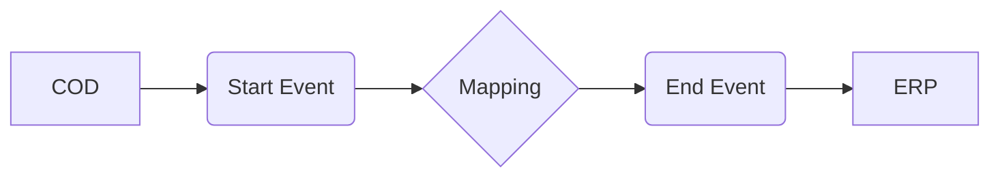

**iFlowId**: Check_Connectivity_to_SAP_Business_Suite_MMZ - **iFlowVersion**: 1.0.4

**Mermaid Diagram**

**Functional Summary**
- **Brief description of the iFlow**
This iFlow performs an end-to-end connectivity check from SAP Cloud for Customer (COD) to SAP ERP via SAP Integration Suite.

- **Involved systems with Adapters Type and Endpoint Type**
    - COD: SOAP Adapter, Endpoint Sender
    - ERP: SOAP Adapter, Endpoint Receiver

- **Key steps**
    1.  Receive request from COD via SOAP.
    2.  Execute a message mapping to transform the message.
    3.  Send the transformed message to ERP via SOAP.

- **Message transformation**
    - A mapping `COD_ERP_CheckEnd2EndConnectivity.opmap` transforms the message between the COD and ERP systems.

- **Externalized parameters list and their descriptions**
    - `COD_enableBasicAuthentication_3`: Enables basic authentication for the COD sender adapter.
    - `subject`: Subject for COD sender adapter.
    - `issuer`: Issuer for COD sender adapter.
    - `COD_address_2`: Address of the COD sender endpoint.
    - `COD_wsdlURL_1`: WSDL URL of the COD sender endpoint.
    - `Protocol-Hostname-Port`: Protocol, Hostname and Port to access ERP.
    - `Client`: SAP Client used for accessing ERP.
    - `ERP_proxyType_4`: Proxy type for the ERP receiver adapter.
    - `artifactname`: Credential Name for the ERP receiver adapter.
    - `ERP_authentication_5`: Authentication Type for the ERP receiver adapter.
    - `ERP_allowChunking_3`: Allow Chunking for the ERP receiver adapter.
    - `ERP_cleanupHeaders_2`: Cleanup Headers for the ERP receiver adapter.
    - `location-id`: Location ID to be used for ERP Receiver Adapter.
    - `p-key-alias`: Private Key Alias for the ERP receiver adapter.

- **DataStore / JMS Dependency**
Not Found

- **Cloud Connector Dependency**
Not Found

- **Common Scripts Dependency**
Not Found

- **ProcessDirect ComponentType Dependency**
Not Found