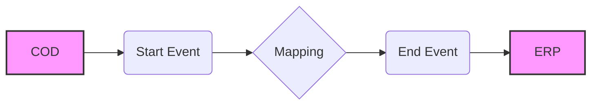

**iFlowId**: Check_Connectivity_to_SAP_Business_Suite_MMZ - **iFlowVersion**: 1.0.4

**Mermaid Diagram**

**Functional Summary**
**Brief description of the iFlow**
This iFlow performs an end-to-end connectivity check from SAP Cloud for Customer (COD) to SAP ERP via SAP Integration Suite.

**Involved systems with Adapters Type and Endpoint Type**
- COD: SOAP Adapter, Endpoint Sender
- ERP: SOAP Adapter, Endpoint Receiver

**Key steps**
1. The iFlow is triggered by an incoming SOAP message from COD.
2. A mapping step transforms the message. The mapping `COD_ERP_CheckEnd2EndConnectivity.opmap` is used.
3. The transformed message is sent to ERP via SOAP.

**Message transformation**
- The iFlow uses the mapping `COD_ERP_CheckEnd2EndConnectivity.opmap` to transform the message between COD and ERP.

**Externalized parameters list and their descriptions**
- `COD_enableBasicAuthentication_3`:  Enables basic authentication for COD.
- `subject`: Subject for COD.
- `issuer`: Issuer for COD.
- `COD_address_2`: Address of the COD endpoint.
- `COD_wsdlURL_1`: WSDL URL of the COD endpoint.
- `Protocol-Hostname-Port`: Protocol, Hostname and Port of ERP system.
- `Client`: Client of the ERP system.
- `ERP_proxyType_4`: Proxy type for ERP connection.
- `location-id`: Location ID for ERP.
- `ERP_authentication_5`: Authentication type for ERP connection.
- `artifactname`: Credential name for ERP authentication.
- `ERP_allowChunking_3`: Allows chunking for ERP.
- `ERP_cleanupHeaders_2`: Cleans up headers for ERP.
- `p-key-alias`: Private key alias.

**DataStore / JMS Dependency**
Not Found

**Cloud Connector Dependency**
Not Found

**Common Scripts Dependency**
Not Found

**ProcessDirect ComponentType Dependency**
Not Found