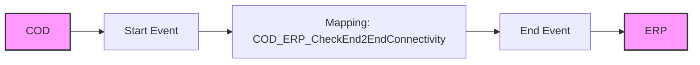

**iFlowId**: Check_Connectivity_to_SAP_Business_Suite_MMZ - **iFlowVersion**: 1.0.4

**Mermaid Diagram**

**Functional Summary**
- **Brief description of the iFlow**
This iFlow performs an end-to-end connectivity check from SAP Cloud for Customer (COD) to SAP ERP via SAP Integration Suite.

- **Involved systems with Adapters Type and Endpoint Type**
  - COD: SOAP Adapter, Endpoint Sender
  - ERP: SOAP Adapter, Endpoint Receiver

- **Key steps**
 1. The iFlow starts with a message from COD via SOAP.
 2. The message is processed by a mapping step (COD_ERP_CheckEnd2EndConnectivity.opmap).
 3. The transformed message is then sent to ERP via SOAP.

- **Message transformation**
  - A mapping step `COD_ERP_CheckEnd2EndConnectivity.opmap` is used to transform the message between COD and ERP.

- **Externalized parameters list and their descriptions**
  - `COD_enableBasicAuthentication_3`: Enables basic authentication for COD.
  - `subject`: Subject for COD.
  - `issuer`: Issuer for COD.
  - `COD_address_2`: Address of COD endpoint.
  - `COD_wsdlURL_1`: WSDL URL for COD.
  - `Protocol-Hostname-Port`: Protocol, Hostname and Port for the ERP endpoint.
  - `Client`: Client ID for the ERP endpoint.
  - `ERP_proxyType_4`: Proxy type for ERP.
  - `location-id`: Location ID for ERP.
  - `ERP_authentication_5`: Authentication type for ERP.
  - `artifactname`: Credential name for ERP.
  - `ERP_allowChunking_3`: Allows chunking for ERP.
  - `ERP_cleanupHeaders_2`: Cleans up headers for ERP.
  - `p-key-alias`: Private key alias.

- **DataStore / JMS Dependency**
Not Found

- **Cloud Connector Dependency**
Not Found

- **Common Scripts Dependency**
Not Found

- **ProcessDirect ComponentType Dependency**
Not Found