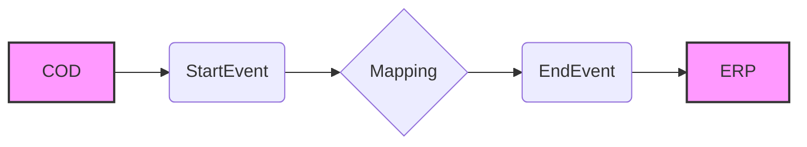

**iFlowId**: Check_Connectivity_to_SAP_Business_Suite_MMZ - **iFlowVersion**: 1.0.4

**Mermaid Diagram**

**Functional Summary**
**Brief description of the iFlow**
This iFlow performs an end-to-end connectivity check from SAP Cloud for Customer (COD) to SAP ERP via SAP Integration Suite.

**Involved systems with Adapters Type and Endpoint Type**
- COD: SOAP Adapter, Endpoint Sender
- ERP: SOAP Adapter, Endpoint Receiver

**Key steps**

1.  The iFlow is triggered by a SOAP call from COD to SAP Integration Suite.
2.  A mapping step transforms the message using the `COD_ERP_CheckEnd2EndConnectivity.opmap` mapping.
3.  The iFlow then sends a SOAP call to the ERP system.

**Message transformation**
-   The message is transformed using a mapping named `COD_ERP_CheckEnd2EndConnectivity` located at `dir://opmap/src/main/resources/mapping/COD_ERP_CheckEnd2EndConnectivity.opmap`.

**Externalized parameters list and their descriptions**

-   COD_enableBasicAuthentication_3: Enables basic authentication for the COD sender adapter.
-   subject: Subject for COD.
-   issuer: Issuer for COD.
-   COD_address_2: Address of the COD endpoint.
-   COD_wsdlURL_1: WSDL URL of the COD endpoint.
-   Protocol-Hostname-Port: ERP Protocol-Hostname-Port.
-   Client: ERP Client.
-   ERP_proxyType_4: Proxy type for ERP receiver adapter.
-   location-id: ERP location ID.
-   ERP_authentication_5: Authentication type for the ERP receiver adapter.
-   artifactname: Credential name for ERP.
-   ERP_allowChunking_3: Enables chunking for the ERP receiver adapter.
-   ERP_cleanupHeaders_2: Enables cleanup headers for the ERP receiver adapter.
-   p-key-alias: Private key alias for ERP.

**DataStore / JMS Dependency**
Not Found

**Cloud Connector Dependency**
Not Found

**Common Scripts Dependency**
Not Found

**ProcessDirect ComponentType Dependency**
Not Found