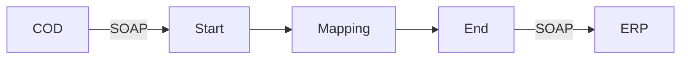

**iFlowId**: Check_Connectivity_to_SAP_Business_Suite_MMZ - **iFlowVersion**: 1.0.4

**Mermaid Diagram**

**BPMN Diagram**

**Functional Summary**
- **Brief description of the iFlow**
  This iFlow performs an end-to-end connectivity check from SAP Cloud for Customer (COD) to SAP ERP via SAP Integration Suite.

- **Involved systems with Adapters Type and Endpoint Type**
    - COD (EndpointSender) - SOAP
    - ERP (EndpointRecevier) - SOAP

- **Key steps**
 1. The iFlow starts with a message from COD.
 2. The message is then passed to a Mapping step (COD_ERP_CheckEnd2EndConnectivity).
 3. Finally, the message is sent to ERP.

- **Message transformation**
    - Mapping: COD_ERP_CheckEnd2EndConnectivity.opmap (src/main/resources/mapping/COD_ERP_CheckEnd2EndConnectivity)

- **Externalized parameters list, configured values and their descriptions**
    - COD_address_2: /COD/ERP/SimpleConnect
    - COD_wsdlURL_1: /wsdl/CheckConnectivityConsumer.wsdl
    - COD_enableBasicAuthentication_3: true
    - ERP_proxyType_4: default
    - ERP_allowChunking_3: 1
    - ERP_cleanupHeaders_2: 1
    - ERP_authentication_5: Client Certificate
    - Protocol-Hostname-Port: https\://erphost\:443
    - Client: 100
    - location-id:
    - artifactname:
    - p-key-alias:
    - issuer: cn\=issuer
    - subject: cn\=subject

- **DataStore / JMS Dependency**
  Not Found

- **Cloud Connector Dependency**
  Not Found

- **Common Scripts Dependency**
  Not Found

- **ProcessDirect ComponentType Dependency**
  Not Found