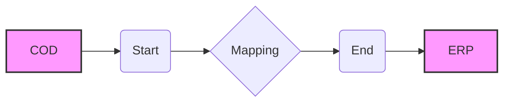

**iFlowId**: Check_Connectivity_to_SAP_Business_Suite_MMZ - **iFlowVersion**: 1.0.4

**Mermaid Diagram**

**Functional Summary**
- **Brief description of the iFlow**
This iFlow performs an end-to-end connectivity check from SAP Cloud for Customer (COD) to SAP ERP via SAP Integration Suite (formerly HCI).

- **Involved systems with Adapters Type and Endpoint Type**
    - COD: SOAP Adapter, EndpointSender
    - ERP: SOAP Adapter, EndpointRecevier

- **Key steps**
    1. The iFlow is triggered by a SOAP call from COD.
    2. A mapping step transforms the message.
    3. The transformed message is sent to ERP via SOAP.

- **Message transformation**
    - The iFlow utilizes a mapping named `COD_ERP_CheckEnd2EndConnectivity.opmap` located in the `src/main/resources/mapping/` directory.

- **Externalized parameters list and their descriptions**
    - `COD_enableBasicAuthentication_3`: Enables basic authentication for the COD sender.
    - `subject`: Subject for COD.
    - `issuer`: Issuer for COD.
    - `COD_address_2`: Address of the COD endpoint.
    - `COD_wsdlURL_1`: WSDL URL of the COD endpoint.
    - `Protocol-Hostname-Port`: Protocol, hostname, and port for ERP connection.
    - `Client`: SAP client for ERP connection.
    - `ERP_proxyType_4`: Proxy type for the ERP receiver.
    - `location-id`: Location ID for the ERP receiver.
    - `ERP_authentication_5`: Authentication method for the ERP receiver.
    - `artifactname`: Credential name for the ERP receiver authentication.
    - `ERP_allowChunking_3`: Allows chunking for ERP receiver.
    - `ERP_cleanupHeaders_2`: Cleans up headers for the ERP receiver.
    - `p-key-alias`: Private key alias for ERP receiver.

- **DataStore / JMS Dependency**
Not Found

- **Cloud Connector Dependency**
Not Found

- **Common Scripts Dependency**
Not Found

- **ProcessDirect ComponentType Dependency**
Not Found