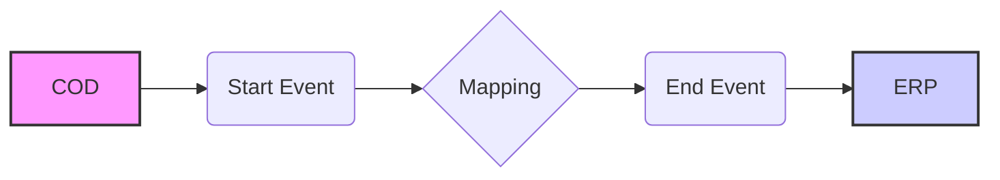

**iFlowId**: Check_Connectivity_to_SAP_Business_Suite_MMZ - **iFlowVersion**: 1.0.4

**Mermaid Diagram**

**Functional Summary**
- **Brief description of the iFlow**
This iFlow performs an end-to-end connectivity check from SAP Cloud for Customer (COD) to SAP ERP via SAP Integration Suite.

- **Involved systems with Adapters Type and Endpoint Type**
    - COD (EndpointSender): SOAP Adapter
    - ERP (EndpointRecevier): SOAP Adapter

- **Key steps**
 1. The iFlow starts with a message received from the COD system via a SOAP sender adapter.
 2. A mapping step transforms the message using the `COD_ERP_CheckEnd2EndConnectivity.opmap` mapping.
 3. The transformed message is then sent to the ERP system via a SOAP receiver adapter.

- **Message transformation**
    - The iFlow uses the `COD_ERP_CheckEnd2EndConnectivity.opmap` mapping to transform the message between the COD and ERP systems.

- **Externalized parameters list and their descriptions**
    - `COD_enableBasicAuthentication_3`: Enables basic authentication for the COD sender adapter.
    - `subject`: Subject for COD.
    - `issuer`: Issuer for COD.
    - `COD_address_2`: Address of the COD endpoint.
    - `COD_wsdlURL_1`: WSDL URL for the COD endpoint.
    - `Protocol-Hostname-Port`: Protocol, Hostname and Port of the ERP endpoint.
    - `Client`: Client for ERP endpoint.
    - `ERP_proxyType_4`: Proxy type for the ERP receiver adapter.
    - `location-id`: Location ID for ERP.
    - `ERP_authentication_5`: Authentication method for the ERP receiver adapter.
    - `artifactname`: Credential name for ERP.
    - `ERP_allowChunking_3`: Allows chunking for the ERP receiver adapter.
    - `ERP_cleanupHeaders_2`: Cleans up headers for the ERP receiver adapter.
    - `p-key-alias`: Private key alias for ERP.

- **DataStore / JMS Dependency**
Not Found

- **Cloud Connector Dependency**
Not Found

- **Common Scripts Dependency**
Not Found

- **ProcessDirect ComponentType Dependency**
Not Found